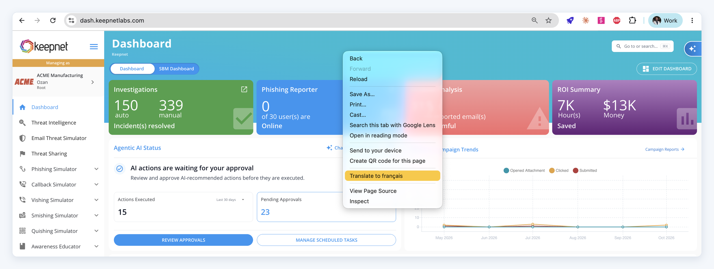
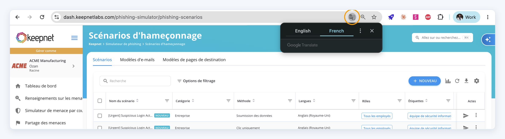
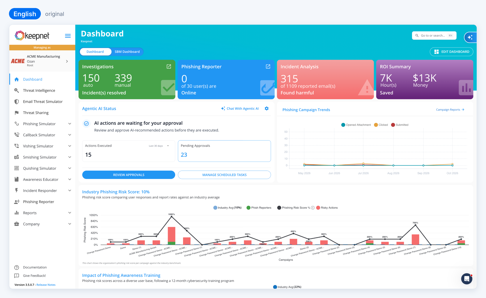
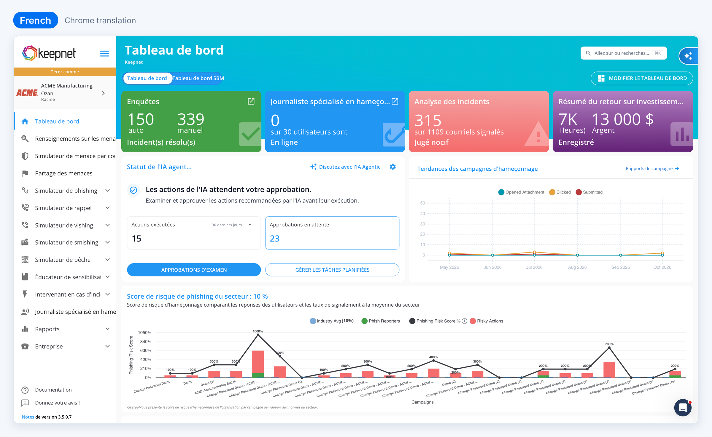
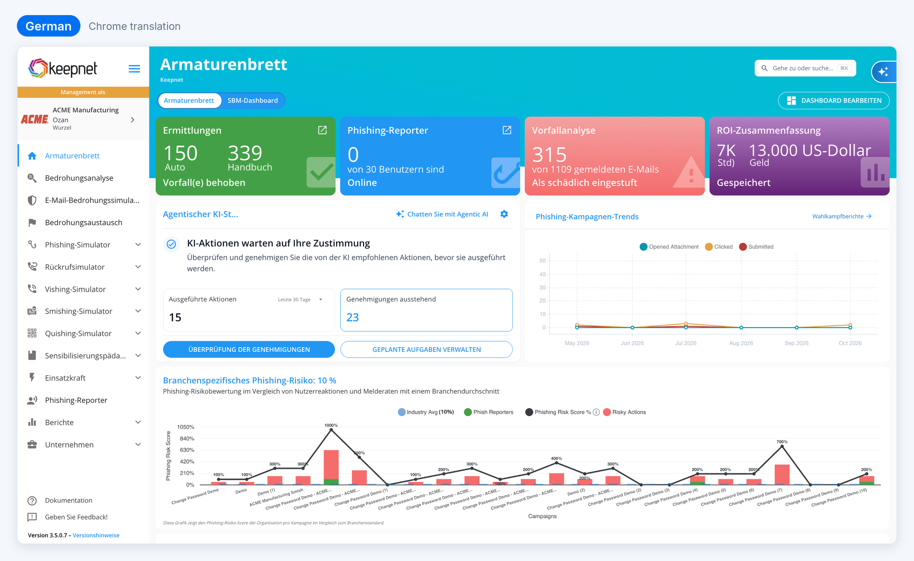
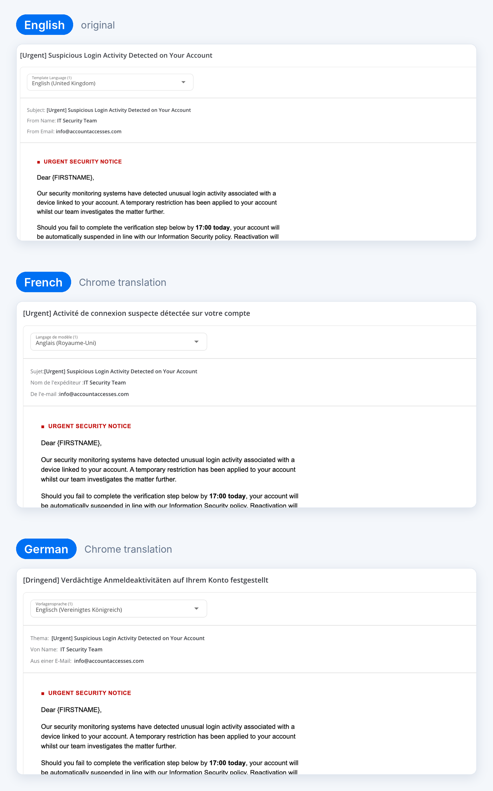
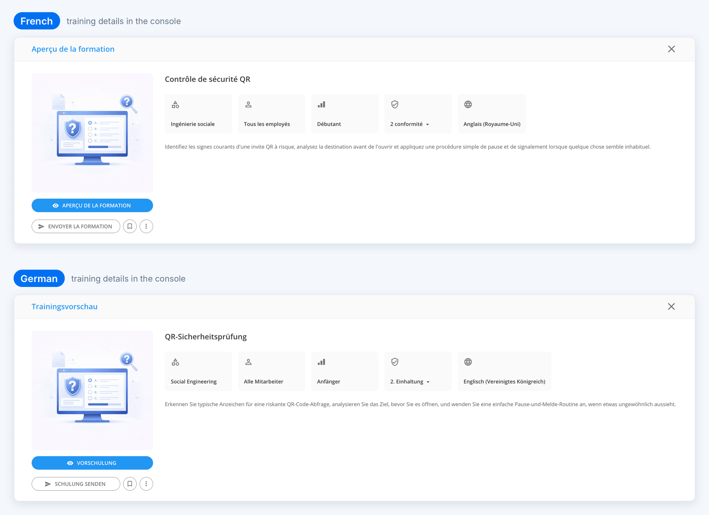
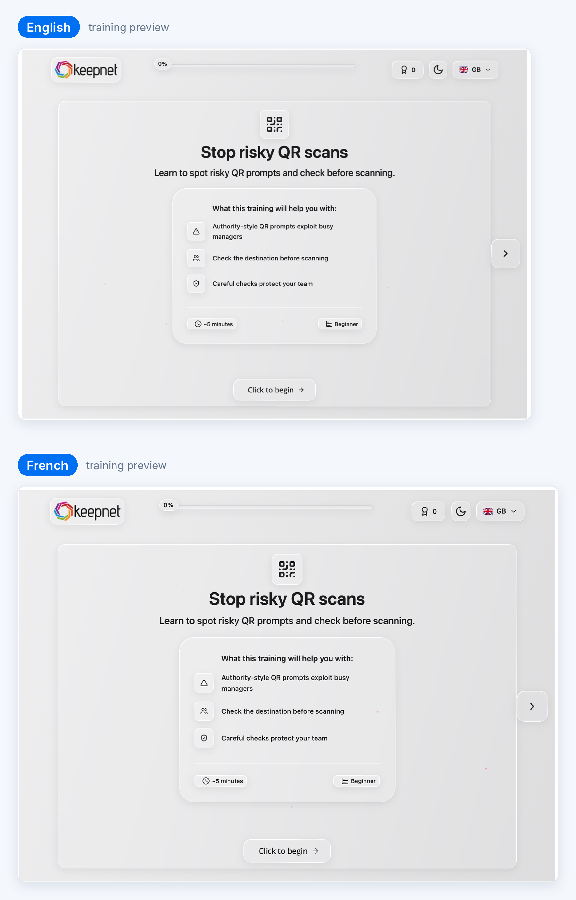

# Admin Console in Your Language

Keepnet admins can use the admin console in French, German or any other language Google Chrome supports. Chrome's built-in translation works on the console today, with no setup in Keepnet.

### At a glance

| Area                                                             | With Chrome translation                   |
| ---------------------------------------------------------------- | ----------------------------------------- |
| Admin console: navigation, dashboards, settings, tables, buttons | Shown in the admin's language             |
| Phishing simulation templates: subject, sender, email body       | Stays in the template's original language |
| Training content                                                 | Stays in the training's original language |

Phishing templates and training are the content employees receive, so Keepnet keeps them out of browser translation. Admins see exactly what employees will see.

### Turn on translation in Chrome

**Step 1.** Open the Keepnet console in Chrome, right-click anywhere on the page and select **Translate to \[your language]**.

<figure><figcaption></figcaption></figure>

**Step 2.** To switch to another language, click the translate icon in the address bar, then select **⋮ > Choose another language**.

<figure><figcaption></figcaption></figure>

**Step 3.** Optional: in the same menu, select **Always translate English** so every console page opens in your language.

To return to English, click the translate icon and select **English**.

### The admin console in French and German

Navigation, dashboard cards, buttons and chart titles follow the language selected in Chrome.

<figure><figcaption></figcaption></figure>

<figure><figcaption></figcaption></figure>

<figure><figcaption></figcaption></figure>

### Phishing templates stay in their original language

In the template preview, the console around the email is translated, including the field labels and the template name. The subject, sender name, sender address and email body stay exactly as employees will receive them.

<figure><figcaption></figcaption></figure>

### Training content stays in its original language

Training details in the console (title, category, audience, description) are translated for the admin.

<figure><figcaption></figcaption></figure>

The training itself plays in its original language, the same as employees see it.

<figure><figcaption></figcaption></figure>

### Good to know

* **Machine translation.** Google Translate produces the wording, so some terms can differ from Keepnet's own product names.
* **Data handling.** When Chrome translates a page, it sends the page text to Google's translation service. Check that this fits your organisation's data policy.
* **Managed devices.** IT teams can turn Chrome translation on or off with the `TranslateEnabled` Chrome policy. If the translate option does not appear, ask your IT team.
* **Employee language.** The language employees receive is set in Keepnet, not in the browser: each template and training has its own language versions, and each employee has a Preferred Language in **Company > Target Users**.
