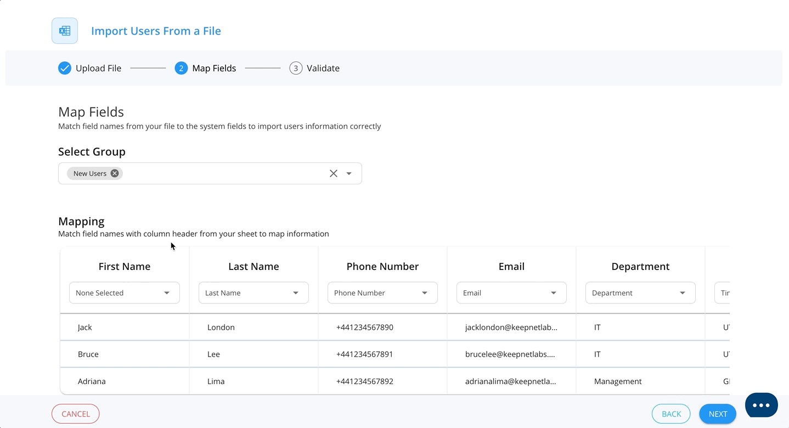

# Add Users via CSV


**Note**: by using this method, you will be responsible for adding new employees and removing leavers to maintain accurate reporting.


#### **Step 1.**

Navigate to **Company > Target Users** on the left hand side menu. Click the **"+New"** blue button.

<figure><figcaption></figcaption></figure>

#### **Step 2.**

Select **Add users manually** to add target users one by one. Alternatively, select **Import from file** to upload a CSV or XLS(x) file.&#x20;


**Top Tip:** Download a CSV template by clicking **Import from file** and selecting 'Download Example Sheet'.



#### **Step 3.**

**Select Group:** If you haven't added any users yet, you will need to create a new group. Some suggested User Groups our customers use:

* Test Group - for your cyber team to test phishing campaigns
* All Users - to easily send campaigns to all employees
* Department Specific e.g. Finance - to easily send targeted campaigns to specific departments&#x20;

<figure><figcaption></figcaption></figure>

**Step 4.**&#x20;

**Field Mapping:** Ensure the fields you are adding in are matched with the correct heading. For example, the user's first name matched with the heading, 'First Name'. Click Next once complete.

<figure><figcaption></figcaption></figure>

**Step 5.**

**Import Users:** Either pick the users you wish to add and click **Import Selected**, or click **Import All** to add all the users.&#x20;

<figure><figcaption></figcaption></figure>

✅ **You have now added your first Target Users. Now you need to** [**ensure users are able to receive emails from Keepnet**](../3.-email-deliverability/) **successfully ➡️**
