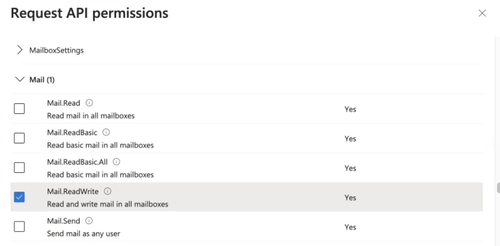

# M365: Direct Email Creation

## **Direct Email Creation** 

**Direct Email Creation (DEC)** is a feature that connects to your O365 with a few required API permissions. This feature creates the phishing simulation email directly in the user’s inbox instead of sending the emails over SMTP protocol.**Key Benefits:**

1. Remove false positives that come from email delivery.
2. Eradicate maintenance and challenges of whitelisting for the purpose of email delivery (you may need to whitelist in your URL protection solutions such as Defender or ZScaler)
3. Very simple and quick setup (can be completed in a couple of minutes!)

## How to Configure Direct Email Creation 

#### **Step 1.**

Go to **Company > Company Settings > Direct Email Creation** from the main menu. Click on **+ NEW** to create a direct email creation setting.

<figure><figcaption></figcaption></figure>

#### **Step 2.**

Click on **Connect Account** button to connect your O365 with the Direct Email Creation (DEC) application to create a configuration.


You can find all API permission settings [here](m365-direct-email-creation.md#about-required-api-permissions)


#### **Step 3.**

Name your DEC, select which domains you will send phishing simulation emails to and **Send Test Email.**

* **Send Test Email To:** Enter the email of the person receiving the test email.
* **Sender Email Address:** Enter any email - you can now send emails from any email address!
* **Sender Name:** Enter a sender name.
* **Message:** Enter a message.
* Click **SAVE** to create configuration settings.

<figure><figcaption></figcaption></figure>

#### **Step 4.**

Make Direct Email Creation your **Default** Delivery Method - this will save you lots of time and remove delivery errors when you start sending phishing campaigns.

<figure><figcaption></figcaption></figure>


**Top Tip:** Make sure to select **Direct Email Creation** in your **Email Delivery** settings when running a new phishing campaign.&#x20;



## About Required API Permissions

Keepnet follows [Microsoft's secure design principles](https://learn.microsoft.com/en-us/entra/identity-platform/permissions-consent-overview?WT.mc_id=Portal-Microsoft_AAD_RegisteredApps) for third-party applications and has received approval from Microsoft. The app uses permissions solely to create simulated phishing emails in users' inboxes. It does not include permission to read, send email or access other mailbox functionalities.

The following permissions are required for customers using the **Microsoft** **365** email server.

<table data-header-hidden><thead><tr><th width="189"></th><th></th></tr></thead><tbody><tr><td>Read and write all applications</td><td>It is used only when the customer uses a custom domain instead of dash.keepnetlabs.com to access the platform. This ensures that the customer can successfully configure the DEC settings on the platform while using the custom whitelabeled domain.</td></tr><tr><td>Read domains</td><td>It is used to fetch the domains that the customer owns in Microsoft 365 and allows the customer to select the relevant domains so the platform can create simulation emails in the user's inbox under the selected domains.</td></tr><tr><td>Read and write mail in all mailboxes</td><td>It is used to create a simulation email in the user's inbox. Please see following screenshot for more information about this permission</td></tr><tr><td>Read all users' full profiles</td><td>It is used to read the user's profile information, retrieve email account details (e.g., email address), and switch to the user's profile to create simulation emails in their inbox.</td></tr><tr><td>Sign in and read user profile </td><td>It is used to read basic company information of the signed-in user who grants permission.</td></tr></tbody></table>

Microsoft bundles permissions together. The following Microsoft screenshot shows a '**Mail**' permission group. There's no separate **Write** permission — only the **Mail.ReadWrite** permission, which handles **Write** **actions**.&#x20;

<figure><figcaption></figcaption></figure>

The following permissions are required for customers using the **Microsoft** **Exchange** **Online** email server.

<table data-header-hidden><thead><tr><th width="180"></th><th></th></tr></thead><tbody><tr><td>Access mailboxes as the signed-in user via Exchange Web Services</td><td>It is used to access user's mailbox in order to create simulation email in the inbox.</td></tr><tr><td>Use Exchange Web Services with full access to all mailboxes</td><td>It is used to create a simulation email in the user's inbox without using a sign-in account.</td></tr><tr><td>Manage Exchange As Application</td><td>It is used to allow the app to manage the organization's Exchange environment without any user interaction.</td></tr></tbody></table>

In summary, customers only need to share the necessary permissions based on their specific environment, whether they use **Microsoft** **365**, **Microsoft** **Exchange** **Online**, or a **hybrid of both**. Keepnet requests these permissions to create simulation emails in the user's inbox across **any of these environments**.

For example, if you use just only **Microsoft** **Exchange** **Online**, then Keepnet only uses the related permission groups for **Exchange** **Online**, other permissions are not used.

## **How to Provide Proof of DEC App Activity for Compliance and Security**

To view the activity of the DEC application created by the platform and confirm that it is only creating simulation emails (and not reading any emails), please follow these steps:

1. **Log in** to the [Microsoft Compliance Portal](https://compliance.microsoft.com/).
2. Navigate to the **Audit** menu.
3. If not already enabled, click to **Enable Audit Logging**.
4. **Set up the DEC configuration** successfully on the platform, and send a test email using the DEC settings to generate activity logs.
5. Go back to the **Audit menu** and search for logs related to the user who sent the test email with DEC settings. Also, you may copy the **Application** **ID** of the DEC application and paste it under the Keyword Search field to search logs.

In the logs, you should see activities such as **"Created mailbox item"**, confirming the application's behavior. For example:

<figure><figcaption></figcaption></figure>

This log indicates that the application is only creating mailbox items and not accessing or reading mailboxes.

✅ **You have now ensured your target users will receive emails through Keepnet. Now you need to** [**Whitelist Domains**](../../recommended-add-domains-to-url-protection/) **so your target users can successfully open Keepnet email links. ➡️**

## Video Tutorial

This video tutorial explains how to configure direct email creation settings and launch a campaign with these settings to create phishing emails directly in the user's inbox instead of launching with the SMTP option.



## FAQ

### Q: Which permissions does the DEC feature work with?

A: Click [here](m365-direct-email-creation.md#about-required-api-permissions) for more information.

### Q: Can I launch a campaign with DEC settings using the Fast Launch option?

A: No, you can only launch a campaign with DEC settings using Campaign Manager. If you launch a campaign with Fast Launch, the campaign will be started with default SMTP settings.

### Q: Do I need to whitelist if I use the DEC feature?

A: If you use only the [Phishing Simulator](https://keepnetlabs.com/products/phishing-simulator) product and use the DEC feature, you don’t need to do [whitelisting](../../../miscellaneous/whitelisting/). If you’re using other products, such as Awareness Educator, you need to do whitelisting since the DEC feature only works for now with the [Phishing Simulator](https://keepnetlabs.com/products/phishing-simulator) product.

### Q: Can I resend the campaign email to the users whose status shows Error in the Sending Report menu in the campaign report?

A: No, the users whose status shows Error means the destination email user account hasn’t been found in the O365, or there might be another problem for these users' email accounts which platform will show you as a tooltip if you hover your mouse over the error status.

### Q: What action should I take for users whose status shows an error ("domain.com" is not in the allowed domain list) in the Sending Report menu after the launch campaign?

A: You can check and make sure you selected the related domain addresses in the DEC configuration, and then you can try to resend the campaign to these users from the Sending Report menu in the campaign report.

### Q: What are the security risks if we authorize the DEC feature on the O365 server?

A: Authorizing the DEC feature on the O365 server doesn’t involve any potential security considerations. Keepnet provides encryption to secure data and prevent unauthorized access to keep your data safe.&#x20;

First, we encrypt data and apply it to our [cryptography policy](https://doc.keepnetlabs.com/resources/compliance#cryptography-policy) and [data protection policy](https://doc.keepnetlabs.com/resources/compliance#data-protection-policy) to make data secure and prevent potential vulnerabilities.&#x20;

Furthermore, we have a strict access policy and do not allow unauthorized gain access to sensitive data; please see our access policy [here](https://doc.keepnetlabs.com/resources/compliance#access-management-procedure).

Keepnet does its best to maintain rigorous security protocols such as regular audits of access rights, continuous monitoring for abnormal activities, and thorough vulnerability assessments.

You can see other data security measures on our [platform security page](../../../../resources/compliance.md).
