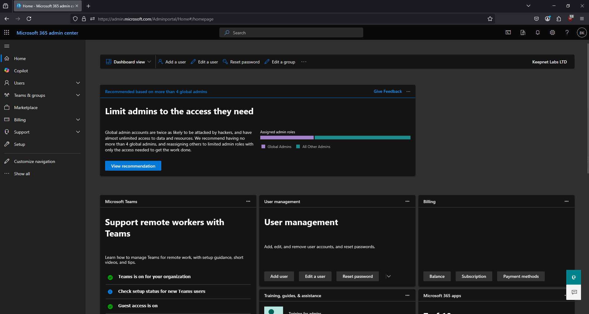
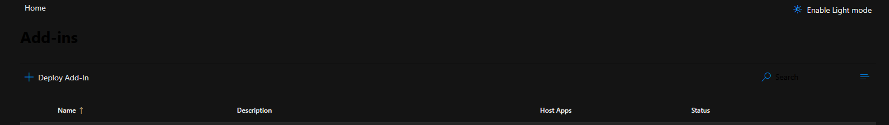
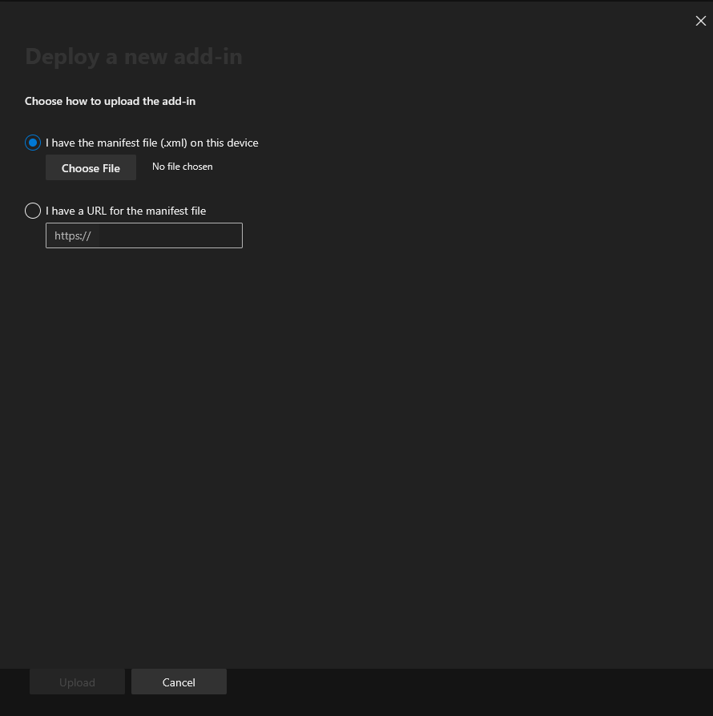

# How to Deploy the Microsoft Ribbon Reporter Add-In

### How to Install the Microsoft Ribbon Phishing Reporter&#x20;

1. Customize [Phishing Reporter](../../../../platform/phishing-reporter/phishing-reporter-customization.md) for your organization's needs
2. Go to **Phishing Reporter > Manage and Download** section and click **“Connect Account”**

<figure><figcaption></figcaption></figure>

3. Log in to your Microsoft 365 account using your admin credentials.
4. Once you log in, the **Permissions** **requested** pop-up window will display. Read the permissions, then click **Accept**.

<figure><figcaption></figcaption></figure>

5. Once you accept the permissions, the GRAPH Authorization Successful window will display.

<figure><figcaption></figcaption></figure>

6. Click the **Download** icon below the **Microsoft** **Ribbon** **Phishing** **Reporter** option to download the **PhishingReporterRibbon.xml** file.
7. In a new tab of your browser, log in to your **Microsoft 365 admin center**.

<figure><figcaption></figcaption></figure>

8. From the menu on the left side of the page, click **Settings**.
9. From the **Settings** drop-down menu, select **Integrated** **apps**.

<figure><figcaption></figcaption></figure>

10. Click Add-ins at the top-right corner of the page. The Add-ins page will open

<figure><figcaption></figcaption></figure>

11. On the Add-ins page, click Deploy Add-In. The Deploy a new add-in pop-up window will open.

<figure><figcaption></figcaption></figure>

12. In the pop-up window, click Next.

<figure><figcaption></figcaption></figure>

13. Click Upload custom apps.

<figure><figcaption></figcaption></figure>

14. Select the **I have the manifest file (.xml) on this device** option. Then, click **Choose** **File** and select the **PhishingReporterRibbon.xml** file that you downloaded in step 6.

<figure><figcaption></figcaption></figure>

15. Click **Upload** to install the Phishing Reporter. The **Configure** **add-in** pop-up window will open.

<figure><figcaption></figcaption></figure>

16. From the pop-up window, select which users will have access to the Phishing Reporter and which method you would like to use to deploy the Phishing Reporter.

<figure><figcaption></figcaption></figure>


We recommend that you allow all users to access the Phishing Reporter. We also recommend that you use the Fixed deployment method.


17. Click **Next**, and additional app permissions will display.
18. Once you have read the permissions, click **Save**. The **Deploy** Phishing Reporter pop-up window will open.

<figure><figcaption></figcaption></figure>


The expected timeframe for the Phishing Reporter to deploy is 24 hours, but timeframes can vary. For more information about deploying add-ins, see Microsoft's [Deploy add-ins in the Microsoft 365 admin center](https://learn.microsoft.com/en-us/microsoft-365/admin/manage/manage-deployment-of-add-ins?view=o365-worldwide#deploy-an-office-add-in-using-the-admin-center) article.


19. Once the pop-up window displays a confirmation that the add-in successfully deployed, click **Next**. The **Announce** **add-in** pop-up window will open and display a message about announcement recommendations from Microsoft.

<figure><figcaption></figcaption></figure>


After you install and deploy the Phishing Reporter, you might receive an email from your mail service provider that contains information you can use to help you announce the Phishing Reporter add-in to your users. Keepnet does not send the email about the Phishing Reporter’s intended usage and benefits.


20. Click Close to close the pop-up window.

## Troubleshooting Microsoft Ribbon Phishing Reporter

### We were unable to process this item. Please try again later.

**"We were unable to process this item. Please try again later."** message in the Ribbon Phishing Reporter in Outlook.

<figure><figcaption></figcaption></figure>

<figure><figcaption>
<strong>We were unable to process this item issue on Microsoft Ribbon Phishing Reporter</strong>
</figcaption></figure>

The suggested solution is to "[Toggling on New Outlook](https://support.microsoft.com/en-gb/office/toggle-out-of-the-new-outlook-for-windows-ec102b39-5727-418e-ae1f-a1805434640c)"

<figure><figcaption>
Toggling on New Outlook
</figcaption></figure>

## Tutorial Video

This video tutorial shows the documentation steps for deploying Microsoft Ribbon Phishing Reporter add-in on M365.


