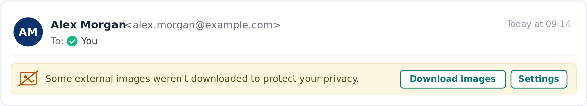

# Tracking Email Opens in Phishing Simulations

Keepnet utilizes a tracking pixel to monitor when users open phishing simulation emails. This tracking pixel is embedded in all phishing simulation emails sent through the platform. When the email is opened and its images load, the pixel sends a response to Keepnet, logging the open event.

Opening a phishing simulation email is **not** considered a failure and does **not** impact the user's gamification score. Phishing emails may also be marked as "opened" automatically when:

* **Email Reported:** the user reports the email with the **Reporter Button**.
* **Phishing Failure:** the user clicks a phishing link or opens a malicious attachment. The email is marked as opened even if the tracking pixel never loads.

## Why Some Email Opens Are Not Recorded

By default, **every Outlook client blocks the automatic download of external (internet-hosted) images** to protect users' privacy. This is standard Microsoft security behavior, not a Keepnet limitation, and it applies across classic Outlook for Windows, New Outlook for Windows, Outlook on the web (OWA), and Outlook for iOS and Android.

When images are blocked, the recipient sees a banner such as **"Some images were blocked"** or **"Download Pictures"** and can load the images manually for that message. Until the images load, the tracking pixel does not fire, so that open is not recorded by the pixel.

Most users may not click "Download Pictures," so opens often go unrecorded by the pixel. This is expected, and open tracking is an optional metric that does not affect a user's score. If you want simulation images and the tracking pixel to load **automatically** when the email is opened, without the user clicking "Download Pictures," use one of the methods below.

<figure><figcaption></figcaption></figure>

## Which Method Applies to Which Outlook Email Client

The default behavior is the same in every client: external images are blocked until the **sender is trusted** or the user loads them manually. To make trusted-sender images load automatically, choose the method that matches your users' Outlook client.

| Your Outlook Client         | Method to Use                                   |
| --------------------------- | ----------------------------------------------- |
| Classic Outlook for Windows | Trusted Zone **or** Safe Senders (either works) |
| New Outlook for Windows     | Safe Senders only                               |
| Outlook on the web (OWA)    | Safe Senders only                               |
| Outlook for iOS / Android   | Safe Senders only                               |

**Why the difference?** The Trusted Zone method relies on Internet Explorer security zones and the classic Outlook Trust Center, which exist **only in classic Outlook**. New Outlook, OWA, and Outlook mobile are web-based clients that do not have those components; in them, automatic image loading is governed **only** by the mailbox **Safe Senders** list. The image URL or hosting domain does not change this; the decision is based on whether the message sender is trusted.


If any of your users are on New Outlook, Outlook on the web, or Outlook mobile, the Trusted Zone method will not work for them. Use **Safe Senders** (see Method 1 below).


The detailed steps for each method follow.

## Method 1: Safe Senders (works on all Outlook clients)

Adding the simulation sender domains to the mailbox **Safe Senders** list tells Outlook to download their images automatically. The Safe Senders list is stored in the Exchange mailbox, so it is honored by Classic Outlook, New Outlook, Outlook on the web, and Outlook mobile alike. This is the **only method that works for New Outlook and the web/mobile clients**.

Trade-offs to be aware of:

* All images from the trusted senders will load, so attentive users may notice that simulation emails render fully while other external emails do not.
* Keepnet sends simulations from many different sender addresses, and these are subject to change, so the list must be kept up to date.

For company-wide consistency, deploy Safe Senders centrally instead of asking each user to configure it.

### Option A: Exchange Online PowerShell (recommended for all clients)

You can add safe senders individually in each user's junk email settings, but that requires every person to configure it themselves. A more efficient approach is to apply the setting for the whole organization with PowerShell.

Run the commands from **Azure Cloud Shell** (open it at [admin.microsoft.com](https://admin.microsoft.com) or [portal.azure.com](https://portal.azure.com), signed in as global administrator), then follow the steps below.

**Step 1: Test on a single mailbox first.**

```powershell
Connect-ExchangeOnline

Set-MailboxJunkEmailConfiguration -Identity user@yourcompany.com `
  -TrustedSendersAndDomains @{Add="sim-domain1.com","sim-domain2.com"}
```

**Step 2: Roll out to all members of a security group.**

```powershell
# Connect to Exchange Online (sign in as global administrator)
Connect-ExchangeOnline

# Get the members of the target security group
$groupUsers = Get-AzADGroup -DisplayName "YOUR GROUP NAME" | Get-AzADGroupMember

# Add the simulation sender domains to each member's Safe Senders list
foreach ($user in $groupUsers) {
    Set-MailboxJunkEmailConfiguration -Identity $user.UserPrincipalName `
      -TrustedSendersAndDomains @{Add="sim-domain1.com","sim-domain2.com"}
}
```

Notes:

* Replace `YOUR GROUP NAME` with your group, and replace the example domains with your simulation sender domains (comma-separated). Find them under **Phishing** > **Settings** > **Domains** in the Keepnet Platform, or contact Keepnet Support.
* The script only affects users who are in the group when it runs. For longer campaigns, re-run it periodically (for example, when new people join).
* After applying, send a phishing test campaign and confirm that opens are recorded.

### Option B: Group Policy

If you manage **Classic Outlook clients** through **Group** **Policy**, you can deploy the **Safe** **Senders** **list** centrally instead of using PowerShell. Rather than repeat the steps here, follow Microsoft's official guide:

* Microsoft Learn: [Deploy junk email settings by using Group Policy](https://learn.microsoft.com/microsoft-365-apps/outlook/email-security/deploy-junk-email-settings)

Use your simulation sender domains, available under **Phishing** > **Settings** > **Domains** in the Keepnet Platform.

## Method 2: Trusted Zone in Outlook (classic Outlook only)


This method applies to **Classic Outlook for Windows only**. It has no effect in New Outlook, Outlook on the web, or Outlook mobile.


In **Classic** **Outlook**, you can create a **Group** **Policy** **Object** in **Active Directory** to update the Trusted Zone so that tracking pixels load without loading every other simulation image:

1. Navigate to your **Local Group Policy Editor**.
2. Go to **User Configuration** > **Windows Settings** > **Administrative Templates** > **Windows Components** > **Internet Explorer** > **Internet Control Panel** > **Security Page**.
3. Double-click the **Site to Zone Assignment List** policy to modify the policy.
4. Enable the policy by selecting the **Enabled** option.
5. Under the **Options** area, click **Show**.
6. From the **Show Contents** window, enter the phish link domain used in your test in the **Value Name**. You can also use wildcards to indicate a phish link subdomain.
7. For the **Value**, enter "2", which corresponds to "Trusted Zone".
8. Click **OK**.
9. Navigate to **Outlook**.
10. Select **Options** > **Trust Center** > **Trust Center Settings**, then select **Allow downloads from Websites in this security zone: Trusted Zone**.

We recommend sending a phishing test campaign to yourself once these settings are saved to confirm opens are being tracked.

Please contact the [support team](../../../resources/keepnet-support-help-desk.md) if you require more information.
