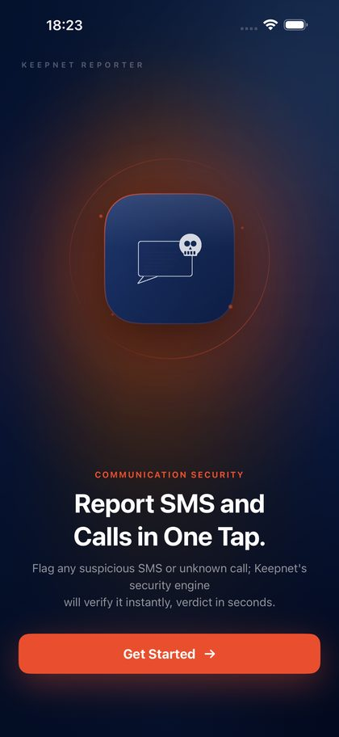

# Keepnet SMS/Call Reporter

[Smishing (SMS phishing) ](smishing-simulator/)and [Vishing (voice phishing) ](vishing-simulator/)reach employees on their phones, outside the email gateway and outside the reporting workflow built around the inbox. An employee who receives a scam text has no equivalent of the [Phishing Reporter button](phishing-reporter/) — the options are to screenshot it and email IT, forward it, or delete it and say nothing.

The **Keepnet SMS/Call Reporter** closes that gap. It is a free app that lets an employee report a suspicious SMS or an unknown call in one tap and get a plain-language answer back on the same phone. No Keepnet licence, no Keepnet account, no management profile.

<figure><figcaption></figcaption></figure>

This page follows the app from installation to reporting to the result, and ends with how to roll it out across an organization.

## 1. How the app works

Three things happen, in order.

1. **The employee reports.** A suspicious message is reported from inside the Messages app; an unknown number from the Recents list in the Phone app. Nothing has to be copied, screenshotted, or forwarded.
2. **The report is analyzed.** The content is first evaluated on the device, so clear-cut cases return an answer immediately. When that is not conclusive, the content, its links, and the number are checked against more than 10 threat-intelligence sources.
3. **The result comes back.** A notification arrives, usually within seconds. It carries one of four plain-language results, the reasons behind it, and the action to take.

Everything else on this page is detail around those three steps.

**What the app does:** it analyzes only what was explicitly reported, lets several messages from the same conversation be reported together, keeps every report in a personal list, and explains each result.

**What the app does not do:** it does not read or scan the inbox, does not reach messages in the background — Apple's privacy framework prevents that — does not require an account, and does not block anything. Its job is reporting and analysis.

_The first step is getting the app onto the phone._

## 2. Setting up on an iPhone

Five steps. The third one is mandatory: skip it and no reporting option appears inside Messages or Phone.

1. **Install from the App Store.** Search for **Keepnet SMS/Call Reporter** by **KEEPNET LABS LTD**, or open [keepnetlabs.com/app](https://keepnetlabs.com/app) on the phone. It is free and needs iOS 16.4 or later.
2. **Pass the welcome screen.** Tap **Get Started** and grant the permission it asks for. Setup cannot continue without it.
3. **Turn the reporting extension on.** Go to **Settings > Apps > Phone > SMS/Call Reporting** and select **Keepnet**. One download installs two things — the app itself, and this extension that runs inside Messages and Phone.
4. **Allow notifications.** The result arrives as a notification. With notifications off, the app has to be opened manually to see it.
5. **Sign in, or stay a Guest.** Signing in with an Apple, Google, or Microsoft account syncs reports across devices. As a Guest, every reporting feature works exactly the same.


**Check it worked.** Open a conversation from an unknown sender in Messages. If a reporting link appears below the messages, setup is done. If it does not, go back to step 3.


An Android version has been submitted to Google Play and is not published yet. The Android steps and store link are added here once it goes live; the reporting flow and the results are the same on both platforms.

_With the extension enabled, the employee can report from the two places where these attacks arrive — Messages and Phone._

## 3. Reporting a suspicious SMS

Reporting happens inside the Messages app, not inside the Keepnet app.

1. **Open the conversation.** The reporting link sits below the messages.
2. **Choose what to report.** **Report All Messages** sends the whole conversation and is the fastest path. To pick individual ones, enter selection mode, tap the circles beside them, then tap **Report Messages**.
3. **Check the confirmation screen.** Keepnet shows how many messages will be sent, who they came from, and the first lines of each — the last chance to verify before anything leaves the phone.
4. **Send, or back out.** The check mark at the top right sends it. The cross at the top left closes the screen and sends nothing.

Only the sender, content, and timestamp of the reported messages are transmitted, encrypted. Nothing else in the inbox is touched.


The reporting link only appears for senders that are not in the contacts list — iOS does not offer junk reporting for saved contacts. To report a message from a known sender, remove them from contacts or report the number from the Phone app instead.


_Calls follow the same pattern, from a different screen._

## 4. Reporting a suspicious call

1. **Open the Recents list** in the Phone app.
2. **Select the unknown number.** It does not have to be written down first.
3. **Choose the reporting option and pick Keepnet.**

When a caller withholds their number, the result screen shows **Unknown number**. That means the number was never presented to the phone, not that the app failed to capture it.

Three things show up again and again in voice fraud, and are worth reporting on sight: a caller claiming to be a bank, an operator, or a public body and asking you to verify yourself; pressure to act immediately before an account is closed or a payment cancelled; and a request for a verification code, password, or card details over the phone — something no real institution does.

_Whichever channel the report came from, the result arrives the same way._

## 5. Reading the result

Tapping the notification, or opening a report in the app, shows the Security Analysis screen: who sent it and when, whether it was an SMS or a call, the message text with links shown but not tappable, a **Reference No** for support requests, and the result with its reasons and a recommended action.

<figure><figcaption></figcaption></figure>

Every report resolves into one of four results.

<table><thead><tr><th width="160.30859375">Result</th><th>What it means</th><th>What to do</th></tr></thead><tbody><tr><td><mark style="color:$success;"><strong>No threat detected</strong></mark></td><td>The message or number did not match known threat indicators.</td><td>Stay cautious. A very new attack may not have reached the intelligence sources yet.</td></tr><tr><td><mark style="color:$warning;"><strong>Suspicious</strong></mark></td><td>Something is off — brand imitation, a mismatched link — but not enough evidence to call it an attack.</td><td>Do not tap the link. Verify the sender through the organization's official channel.</td></tr><tr><td><mark style="background-color:$warning;"><strong>Spam</strong></mark></td><td>Unsolicited bulk messaging rather than a targeted attack.</td><td>Do not reply. Use the mobile operator's blocking options if needed.</td></tr><tr><td><mark style="color:$danger;"><strong>Malicious</strong></mark></td><td>Linked to a known attack — a phishing site, payment fraud, or credential harvesting.</td><td>Do not tap the link and do not reply. If it was already opened, change the password, turn on multi-factor authentication, and tell the bank if card details were entered.</td></tr></tbody></table>

A result describes the reported item, not the sender's intent. **No threat detected** is not a guarantee that a message is safe; verifying an unexpected message with the organization it claims to come from is still the safest move. If a result looks wrong, feedback can be sent from the same screen and is used to improve the analysis rules.

_Every result is kept, so the employee can look back at what they reported._

## 6. Report history and analytics

<figure><figcaption></figcaption></figure>

**My Reports** holds every report from that device, grouped under Today, Yesterday, and older. It filters by type (SMS or call), by time (24 hours, 7 days, 30 days, all), and by result, and searches by sender, message text, or reference number. The coloured strip on each card shows risk — red for malicious, amber for suspicious, green where nothing was found. On the Home screen the same strip shows the channel instead: blue for SMS, orange for calls.

<figure><figcaption></figcaption></figure>

**Analytics** summarizes a chosen period: how many reports were sent and what share carried risk, the split between SMS and calls, a 14-day trend with the two channels separated, and the breakdown by result.

_The question employees ask before any of this is what the app can see._

## 7. What leaves the phone

The most frequent question about the app is whether it reads messages. It does not.

<table><thead><tr><th width="207.08984375"></th><th></th></tr></thead><tbody><tr><td><strong>Inbox access</strong></td><td>None. The app neither reads nor scans the SMS inbox, and Apple's privacy framework blocks background access to messages.</td></tr><tr><td><strong>When anything is sent</strong></td><td>Only when the check mark on the confirmation screen is tapped.</td></tr><tr><td><strong>What is sent</strong></td><td>The sender, content, and timestamp of the reported messages, encrypted.</td></tr><tr><td><strong>How long it is kept</strong></td><td>90 days, then deleted automatically.</td></tr><tr><td><strong>Export and deletion</strong></td><td>Report data can be exported or deleted from the app at any time. Deleting the account removes the reports from the server too.</td></tr></tbody></table>

Telling employees this first — the inbox is not read, only the reported item is sent — is what moves adoption. It belongs at the top of any announcement.

_That announcement is part of rolling the app out._

## 8. Rolling it out to an organization

Two routes. Employees install it themselves from the App Store, or the organization pushes it to managed iPhones. Nothing is configured on the Keepnet side either way, and no enterprise certificate or custom build is involved.

Reports currently come back to the employee inside the app. Central visibility of SMS and Call reports alongside reported emails in Incident Responder is planned for a future release. To discuss reporting requirements across an organization, [contact the Keepnet team](../../resources/keepnet-support-help-desk.md).

### Employees install it themselves

Send the App Store link with a short announcement. This suits organizations without mobile device management, and cases where employees report from personal handsets.

> **Subject: A new app on your work phone — report scam texts and calls**
>
> Scam texts and calls are now one of the most common ways attackers reach people directly, and until now there was no simple way to report them.
>
> Two minutes to set up:
>
> 1. Install Keepnet SMS/Call Reporter from the App Store.
> 2. Go to Settings > Apps > Phone > SMS/Call Reporting and select Keepnet.
> 3. The next time a suspicious text or call arrives, report it in one tap.
>
> The app does not read your messages and does not record your calls. It only sends what you choose to report.

### Pushing it through MDM

The app is a public App Store app, so it is assigned to managed iPhones through Apple Business Manager and any MDM platform — Intune, Jamf, Workspace ONE — exactly like any other store app.

Four things need to be in place first: an Apple Business Manager account with a Content Manager role, an MDM holding a current location token from it (tokens last a year), devices already enrolled — Automated Device Enrollment gives the cleanest result — and iOS 16.4 or later.

1. **Acquire the licences.** In Apple Business Manager open **Apps and Books**, find **Keepnet SMS/Call Reporter**, and assign the quantity needed to the location linked to the MDM. The app is free, so this costs nothing; it places the app under central management.
2. **Sync the MDM** with Apple Business Manager so the licences appear in the app catalogue.
3. **Assign it as required, with device licensing.** Device licensing avoids asking employees for a personal Apple Account and consumes one licence per device. In Intune: **Apps > All Apps >** the app **> Properties > Edit** next to **Assignments > Required**.
4. **Pilot first.** The MDM does not install the app itself — it tells Apple which licence belongs to which device, and the install happens between Apple and the device, which must be unlocked and checked in.

How quiet the install is depends on enrolment type.

| Device and enrolment type                      | Install prompt        | Apple Account required                                                                            |
| ---------------------------------------------- | --------------------- | ------------------------------------------------------------------------------------------------- |
| Company-owned, supervised, device licensed     | None — fully silent   | No                                                                                                |
| Company-owned, not supervised, device licensed | Employee accepts once | No                                                                                                |
| Personal device (BYOD), device licensed        | Employee accepts once | No                                                                                                |
| User Enrollment devices                        | Employee accepts once | Yes — device licensing is not supported, so a user licence with a Managed Apple Account is needed |


**One step cannot be pushed centrally.** Turning on the reporting extension under **Settings > Apps > Phone > SMS/Call Reporting** is a per-user choice on iOS. MDM installs the app; each employee still has to enable Keepnet there before the reporting option appears. Say this explicitly in the rollout message.


**Afterwards:** acquire a few more licences than there are devices to cover replacements; keep automatic app updates on in the Apple Business Manager token settings, since a device-licensed app only updates through the MDM channel and can take 24 hours to reach a device; and unassigning the app reclaims the licence and removes the managed copy. Android devices cannot be covered yet — the app is not on Google Play, and those steps are documented here once it is.

## 9. FAQs

### Q: Is a Keepnet account required?

A: No. Signing in is optional; as a Guest every reporting feature works the same.

### Q: Is the app free?

A: Yes, on the App Store. For enterprise use and licensing, contact the Keepnet team.

### Q: Which devices are supported?

A: Any iPhone on iOS 16.4 or later. The download is 10.4 MB.

### Q: Is there an Android version?

A: It has been submitted to Google Play and is not available yet. This page is updated with the store link and installation steps once it is published.

### Q: Which languages does the app have?

A: Ten: Arabic, Chinese (Simplified), English, French, German, Hindi, Italian, Portuguese, Spanish, and Turkish. The reporting screen that appears inside Messages follows the phone's system language rather than the language chosen in the app.

### Q: Does the app read my messages?

A: No. The inbox is neither read nor scanned; only the item chosen for reporting is sent.

### Q: The reporting option does not appear in Messages.

A: Check that Keepnet is enabled under **Settings > Apps > Phone > SMS/Call Reporting**.

### Q: Why can some messages not be reported?

A: iOS only offers junk reporting for senders that are not in the contacts list. Messages from a saved contact do not show the link.

### Q: I started reporting the wrong message — can I cancel?

A: Yes. Tap the cross at the top left of the confirmation screen; nothing is sent.

### Q: How long does a result take?

A: Usually seconds. Cases needing deep analysis can take a minute or two.

### Q: How long are reports kept?

A: 90 days, then deleted automatically. They can also be deleted manually at any time.

### Q: What should I share when contacting support?

A: The **Reference No** from the result screen, which locates the record immediately.
