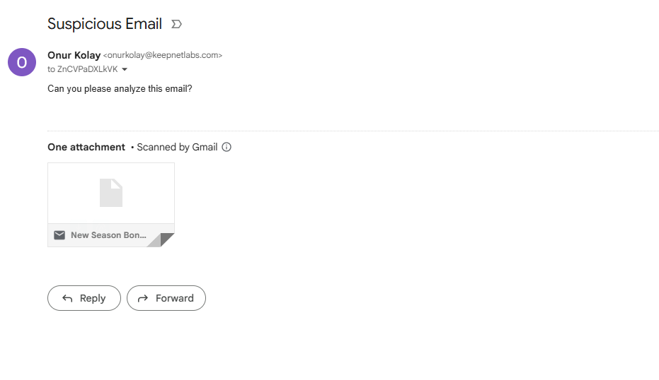

# Integrating Email Reporting with Keepnet

Keepnet can integrate with any email security solution that supports reporting suspicious emails. The key requirement is that the original reported email must be included as an EML attachment. Once forwarded, Keepnet automatically parses and analyzes the attached email.

## How It Works

1. A user reports a suspicious email through their email security solution.
2. The reported message is forwarded to Keepnet (Please [**contact the support team**](../../../resources/keepnet-support-help-desk.md) of Keepnet to get the **Keepnet email address for forwarding**.)
3. The original email is attached as an EML file within the forwarded report.
4. Keepnet workers parse the EML file and perform analysis.

This process allows Keepnet to receive and analyze any type of email, regardless of content, as long as it contains an EML attachment.

## Requirements

* The reported email must include the original message in .eml format.
* The email security solution must be able to forward reported messages to a designated mailbox with the EML attachment included.

## Integration Steps

1. Configure your email security solution
2. Ensure that reported emails are forwarded to the mailbox address provided by Keepnet.
3. Verify that the forwarded report includes the original suspicious message as an EML attachment.
4. Report a sample email through your email security solution.
5. Confirm that Keepnet receives the forwarded message.
6. Verify that the original reported email is present and analyzed successfully.

## Supported Solutions

Any solution is supported, as long as it forwards reported messages with the original email attached as an EML file. Examples include, but are not limited to:

* Native email clients (Outlook, Gmail, etc.)
* Third-party reporting add-ins
* Secure email gateways

## Troubleshooting

* **No analysis performed:** Check that the reported email included the original message as an EML attachment.
* **Attachment missing:** Review the configuration of your email security solution to ensure EML attachments are preserved when forwarding.

Sample reported email:&#x20;

<figure><figcaption></figcaption></figure>


