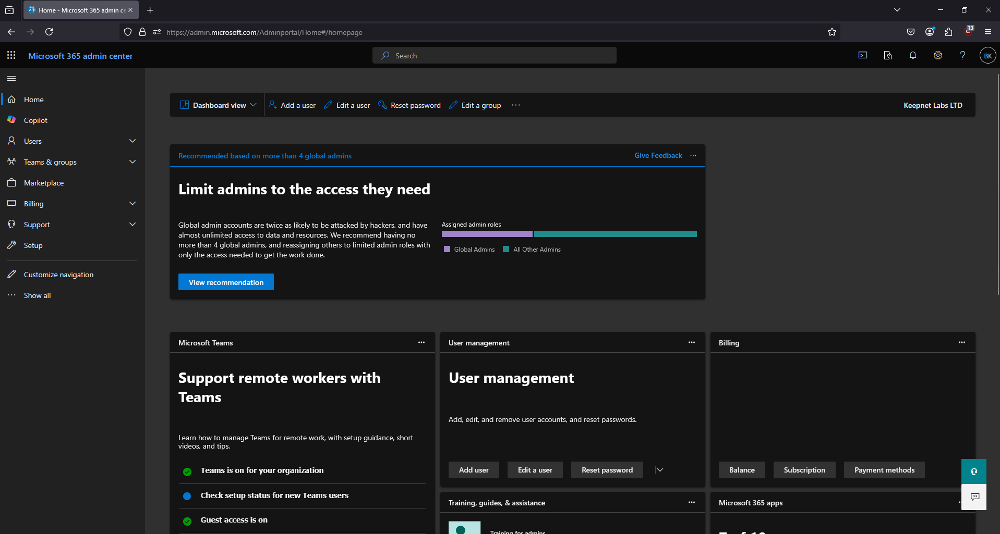
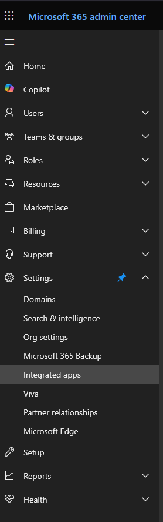
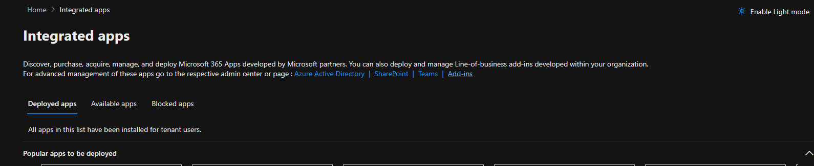
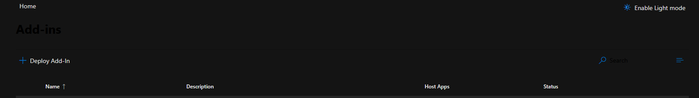
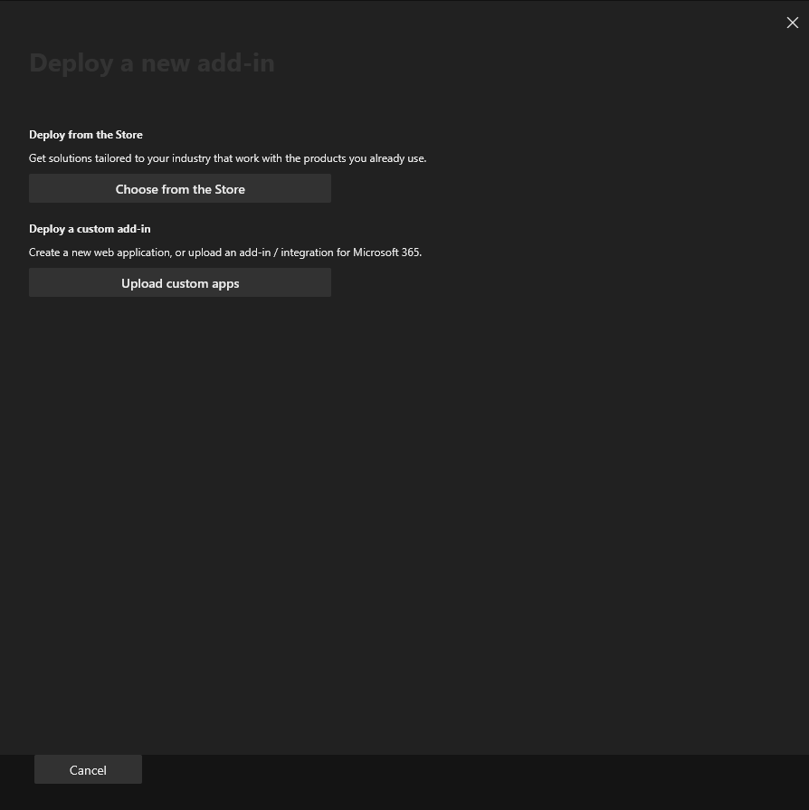
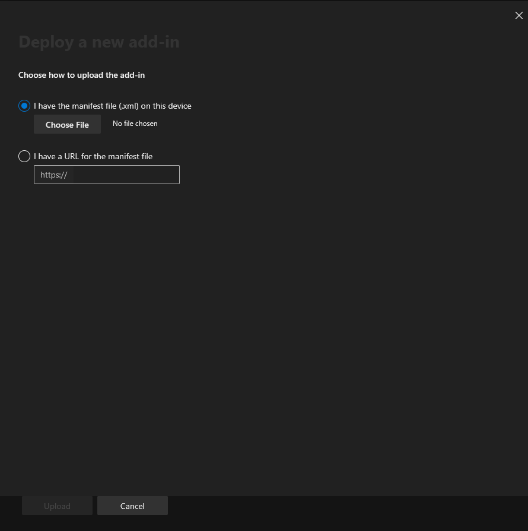
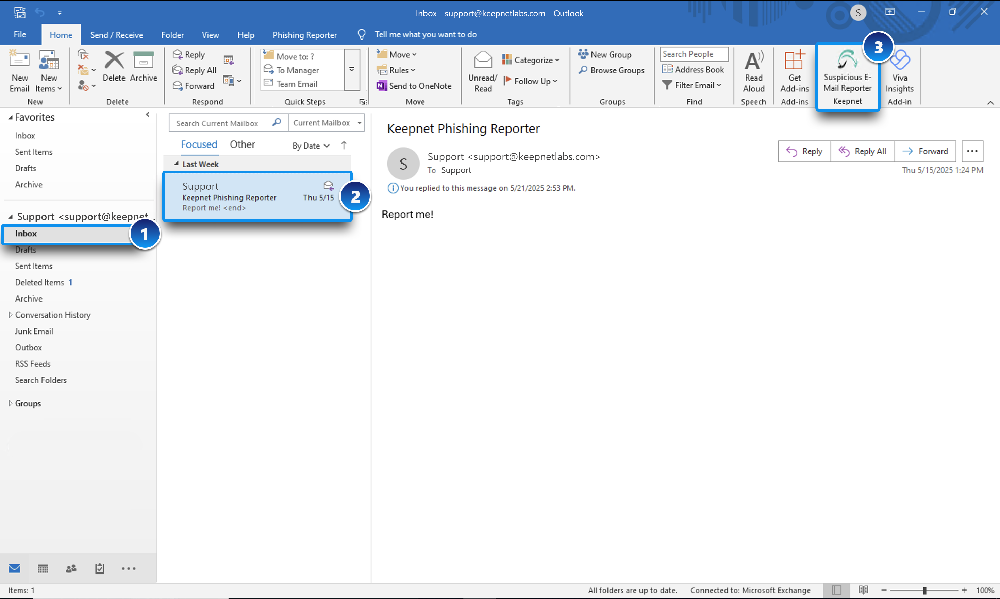
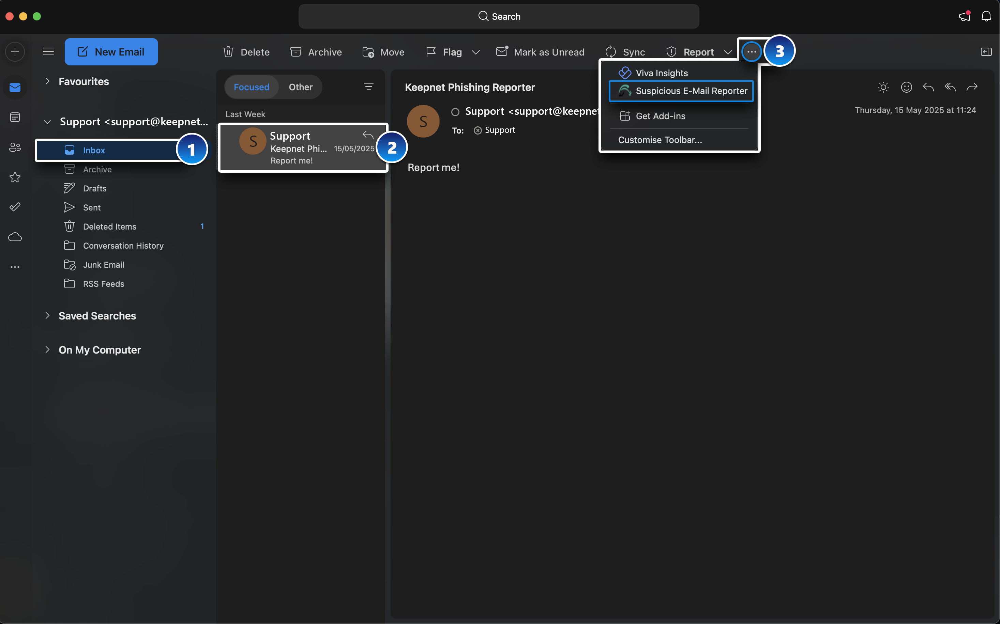
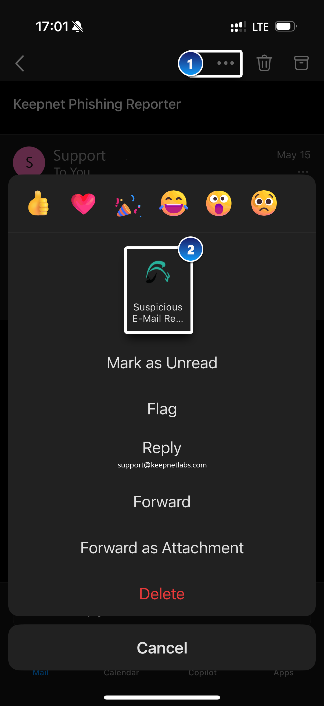

# Microsoft Page View Phishing Reporter

The **Microsoft** **Page View Phishing Reporter** is a Microsoft Outlook add-in developed by Keepnet that enables your users to quickly and securely report suspicious emails with a single click—directly from their email view pane. This helps your organization detect threats early and respond to phishing attempts more effectively.

### Which Outlook Platforms and Browsers Are Supported?

The **Microsoft** **Page View Phishing Reporter** is built using the Microsoft Graph API and is designed to provide a seamless, modern experience across **all major Outlook platforms**. Unlike the traditional [Microsoft Ribbon Phishing Reporter](microsoft-ribbon-phishing-reporter.md) that appears in the toolbar, the Page View version is **embedded directly within the email view pane**, providing a more integrated user interface.

[Click here](./#comparison-ribbon-vs-page-view-vs-msi-outlook-phishing-reporter-microsoft-365) to view the list of compatible Outlook platforms that support the Microsoft Page View Phishing Reporter.

This cross-platform and cross-browser support ensures that your users can report suspicious emails **consistently and securely on Outlook platforms**, regardless of the device or environment they’re using.

## Where Are Reported Emails Sent?

When a user clicks the **Phishing Reporter** button, **the** **reported suspicious email** **is sent** to one or more destinations, depending on your organization's needs:

* 📌 **Microsoft 365 Defender portal**\
  Emails can be submitted directly to Microsoft for further analysis and contribution to spam/phishing intelligence (optional setup). Please refer to [this document](../integrating-microsoft-defender-with-keepnet-phishing-reporter.md) for setup.
* 📌 **SOC or IT team's inbox**\
  The reported email can be forwarded to your designated inbox for internal analysis and response (optional setup). Please [visit here](../phishing-reporter-customization.md#email-settings) for more information.
* 📌 **Keepnet Incident Responder** _(if licensed)_\
  If your organization uses [Keepnet’s Incident Responder](../../incident-responder/), the reported email is also logged in the portal for case management, automated response, and automated analysis.

This flexible approach allows your organization to respond quickly to threats using your preferred tools and workflows.

## What Happens When Users Report Simulated Emails?

If you are running simulated phishing campaigns such as [**Phishing Simulator**](../../phishing-simulator/), [Callback Simulator](../../callback-simulator/), [Quishing Simulator ](../../quishing-simulator/)through Keepnet, the **Phishing Reporter** can automatically detect and log when a user reports a simulated phishing emails.&#x20;

This allows you to:

* Track individual user performance,
* Identify who successfully recognized phishing simulation campaign emails, and
* Generate behavior-based metrics for awareness training.

This feature helps improve your organization’s overall security posture by providing **real-time insight into user vigilance**. Please see the following hint for the **'real-time insights into user vigilance'** explanation.


If the **"Turn off email forwarding for reported Phishing Simulation Emails"** option is enabled by the admin while customizing the phishing reporter button, a pop-up message will appear thanking the user for their awareness each time they report simulation emails, reinforcing positive behavior.  Please [see here](../phishing-reporter-customization.md#add-in-settings) for more information about this option.


## What Happens When an Employee Reports an Email

When an employee uses the **Page View Phishing Reporter Add-in** to report a suspicious email, the reported email will be sent with a detailed report directly to your designated SOC or IT email address.


If you purchased the [Keepnet Incident Responder](../../incident-responder/) product, the email will also be sent for automated analysis, automated response, and case management.


<figure><figcaption></figcaption></figure>

The email that is sent to the SOC/IT team inbox includes:

* The attached **original email** as an `.eml or .msg` file
* The attached **full message header of the original reported email** as a `headers.txt` file
* The **reporting reason** selected by the employee (e.g., spam, phishing, unsure)
* Any **additional comments** the employee entered in the message box

This structured report helps your security team quickly understand the context and take action, without needing to follow up with the reporting user.

## Microsoft Page View Phishing Reporter User Experience

Here is an example view of the **Microsoft Page View Phishing Reporter** button on the **New Outlook Desktop**.

<figure><figcaption>
Picture 1: View of Microsoft Page View Phishing Reporter button on New Outlook Desktop App
</figcaption></figure>

* When using the **Phishing** **Reporter** **button**, clicking the report button **opens a side panel** instead of the pop-up window.

<figure><figcaption>
Picture 2: Reporting side panel of Microsoft Page View Phishing Reporter Button on New Outlook Desktop App
</figcaption></figure>

### How to Install the Microsoft Page View Phishing Reporter&#x20;

1. Before deploying the button, we recommend customizing it. This can be done in the **Add-In Settings** tab under the [Phishing Reporter](../phishing-reporter-customization.md) menu on the Keepnet platform.
2. Once customization is complete, stay on the **Settings** tab. Scroll down to the bottom and click **Manage and Download**. A pop-up will appear — select **Authorize** for **Delegated** **Access** to proceed.
3. If your organization is using **Conditional** **Access** or **Advanced** **Identity** **Policies**, which may affect the reporter button not working, please authorize the **Application-Level Access** too.

<figure><figcaption>
Picture 3: Download Button panel on Phishing Reporter page
</figcaption></figure>

3. Log in to your [Microsoft 365](https://admin.microsoft.com/) account using your **global admin credentials**.
4. Once you log in, the **Permissions** **requested** pop-up window will display. Read the permissions, then click **Accept**.

<figure><figcaption>
Picture 4: Required Graph API Permissions for  Microsoft Page View Phishing Reporter button
</figcaption></figure>

#### Understanding Required Microsoft Graph API Permissions&#x20;

The **Microsoft Page View Phishing Reporter** requires specific Microsoft Graph API permissions to function effectively within an organization’s Microsoft 365 environment. These permissions allow the application to interact with users’ emails, retrieve necessary details for reporting phishing attempts, and ensure smooth integration with the email infrastructure.&#x20;

Below is a breakdown of the permissions required and their purpose:

**1. Mail Permissions**

* **Mail.Read**: Allows the Phishing Reporter to read the user’s email to retrieve necessary email details such as headers, attachments, and content.
* **Mail.Read.Shared**: Extends read access to shared mailboxes, ensuring that the application can retrieve phishing emails reported from shared accounts.
* **Mail.ReadWrite**: Provides both read and write access to the user’s mailbox, enabling modifications or tagging of emails as needed.
* **Mail.ReadWrite.Shared**: Extends read and write permissions to shared mailboxes for better handling of phishing reports.
* **Mail.Send**: Enables the application to send emails, which may be necessary when forwarding reported phishing emails.
* **Mail.Send.Shared**: Allows the application to send emails from shared mailboxes when the user has the appropriate permissions.

**2. User Profile Permissions**

* **profile**: Allows the Microsoft Page View Phishing Reporter to retrieve basic user profile information, ensuring accurate reporting and tracking.

5. Once you accept the permissions, the **GRAPH Authorization Successful** window will display.

<figure><figcaption>
Picture 5: Graph Authorization Successfull message on Phishing Reporter page
</figcaption></figure>

6. Click the **Download** button for the **Page** **View** button under the **Microsoft** **365** to download the **Microsoft365PhishingReporterAddin.xml** file.
7. In a new tab of your browser, log in to your [**Microsoft 365 admin center**](https://admin.microsoft.com/).

<figure><figcaption>
Picture 6: Microsoft 365 Admin Center
</figcaption></figure>

8. From the menu on the left side of the page, click **Settings**.
9. From the **Settings** drop-down menu, select **Integrated** **apps**.

<figure><figcaption>
Picture 6: Integrated Apps on Microsoft 365 Admin Center
</figcaption></figure>

10. Click **Add-ins** at the top-right corner of the page.

<figure><figcaption>
Picture 7: Add-Ins button access on Integrated Apps page
</figcaption></figure>

11. On the add-ins page, click **Deploy** **Add-In**.&#x20;

<figure><figcaption>
Picture 8: Click deploy add-In button
</figcaption></figure>

12. In the pop-up window, click **Next**.

<figure><figcaption>
Picture 9: Deploy a new add-in pop-up message.
</figcaption></figure>

13. Click the **Upload** **custom** **apps** button.

<figure><figcaption>
Picture 10: Deploy a custom add-in page
</figcaption></figure>

14. Select the '**I have the manifest file (.xml) on this device'** option. Then, click **Choose** **File** and select the **Microsoft365PhishingReporterAddin.xml** file that you downloaded in step 6.

<figure><figcaption>
Picture 11: Uploading XML file to deploy the Microsoft Page View Phishing Reporter add-in
</figcaption></figure>

15. Click **Upload** to install the **Microsoft** **Page** **View** **Phishing** **Reporter** add-in.&#x20;

<figure><figcaption>
Picture 12: Deployment Settings for Microsoft Page View Phishing Reporter add-in
</figcaption></figure>

16. From the pop-up window, select **which users will have access to the Microsoft Page View Phishing Reporter** and **which method** you would like to use to deploy the Phishing Reporter.


We recommend that you **allow all users** to access the Phishing Reporter. We also recommend that you use the '**Fixed' deployment method**.


<figure><figcaption>
Picture 13: The list of permissions that are used by the Microsoft Page View Phishing Reporter add-in
</figcaption></figure>

17. Click **Next**, and additional app permissions will display.
18. Once you have read the permissions, click **Save**.&#x20;

<figure><figcaption>
Picture 14: Successful deployment message of Microosft Page View Phishing Reporter add-in
</figcaption></figure>


The expected timeframe for the Phishing Reporter to deploy is 12 hours, but timeframes can vary. For more information about deploying add-ins, see Microsoft's [Deploy add-ins in the Microsoft 365 admin center](https://learn.microsoft.com/en-us/microsoft-365/admin/manage/manage-deployment-of-add-ins?view=o365-worldwide#deploy-an-office-add-in-using-the-admin-center) article.


19. Once the pop-up window displays a confirmation that the add-in has been successfully deployed, click **Next**. The **Announce** **add-in** pop-up window will open and display a message about announcement recommendations from Microsoft.

<figure><figcaption>
Picture 15: Default announcement message provided by Microsoft to inform employees
</figcaption></figure>


After you install and deploy the Phishing Reporter, you might receive an email from your mail service provider that contains information you can use to help you announce the Phishing Reporter add-in to your users. Keepnet does not send the email about the Phishing Reporter’s intended usage and benefits.


20. Click **Close** to close the pop-up window.

## How Microsoft Page View Phishing Reporter Buttons Look on Outlook Platforms

The **Microsoft Page View Phishing Reporter** button enables users to report suspicious emails quickly and efficiently across various Outlook environments. This guide visually demonstrates how the Phishing Reporter button appears and can be accessed in different Outlook platforms: **New Outlook**, **Classic Outlook**, **Outlook Web App (OWA)**, **Outlook for Mac**, and **Outlook Mobile (iOS/Android)**.

### New Outlook

In the redesigned **New Outlook** interface, the **Phishing** **Reporter** button is located in the **right-hand apps panel** while viewing an email.

1. Go to your **Inbox**.
2. Select the suspicious email.
3. Click the **Apps icon** (grid icon) on the right-hand side panel.
4. Choose **Phishing** **Reporter** from the list.

<figure><figcaption></figcaption></figure>

### Classic Outlook

In the **Classic** **Outlook** interface, the button is integrated into the **ribbon toolbar** at the top.

1. Navigate to your **Inbox**.
2. Open the email you want to report.
3. Click the **Phishing Reporter** button on the ribbon at the top of the message window.

<figure><figcaption></figcaption></figure>

### Outlook Web App (OWA)

For users accessing **Outlook via a web browser**:

1. Open your **Inbox** in Outlook on the web.
2. Select the suspicious email.
3. Click the **Apps icon** (grid icon) located in the message view panel.
4. Click on **Phishing Reporter**.

<figure><figcaption></figcaption></figure>

### Outlook for Mac

In **macOS** versions of Outlook, the button is accessible through the top toolbar options.

1. Go to your **Inbox** and select the suspicious email.
2. Click the **three-dot icon (•••)** in the top-right corner.
3. Select **Phishing Reporter** from the dropdown menu.

<figure><figcaption></figcaption></figure>

### Outlook Mobile (iOS / Android)

On mobile devices, the reporting option is available via the message action menu:

1. While viewing the suspicious email, tap the **three-dot menu (•••)** in the top-right corner.
2. Tap on the **Phishing Reporter** icon from the list of options.

<figure><figcaption></figcaption></figure>

## Why Do Some Users See a Popup or Redirection?

When using Keepnet’s Phishing Reporter, most users can report phishing emails with a single click — seamlessly and silently. However, some users may occasionally see a popup window or get redirected briefly to Microsoft’s login screen.

This behavior is expected, safe, and part of Microsoft’s secure authentication process.

#### What Is Supposed to Happen?

Keepnet’s Phishing Reporter is designed to authenticate users automatically in the background. In most cases, if the user is already signed into Microsoft 365, the system can confirm their identity silently without any additional steps.

#### So Why Is There Sometimes a Pop-up or Redirection?

A small number of users may see a sign-in prompt because:

* **They haven’t used the add-in before,** and the system needs their permission
* **Their Microsoft 365 session has expired,** and reauthentication is required
* **Their browser or security settings block silent sign-in,** which is common in private/incognito mode or stricter corporate environments
* **Microsoft requires additional verification,** such as multi-factor authentication
* **They’re on a new device or browser** that Microsoft doesn’t recognize

In any of these cases, the system must briefly show a popup or redirect them to sign in securely before proceeding.

#### Will This Happen Every Time?

No. Once a user has signed in and given the necessary permissions, their session is remembered. They typically won’t be asked to sign in again unless:

* Their session expires (after days or weeks)
* Company policy or security tools clear their session
* New permissions are requested

#### Bottom Line

Popups or redirections are not errors — they’re part of Microsoft’s secure identity verification process. They ensure that only authorized users can access sensitive data and perform actions like reporting emails.&#x20;

Keepnet follows Microsoft’s best practices to provide the most seamless experience possible, while maintaining strict security and compliance.

## Frequently Asked Questions (FAQs)

### Q: Can I show a confirmation prompt before deleting a reported email?

**A:** Yes. To enable a confirmation prompt, go to the **Phishing Reporter** menu and select the **Settings** tab. Within the tab, scroll down to the **Dialog Box Settings** section. Locate the **Delete Reported Emails** option, and select **With Confirmation** from the dropdown menu.

### Q: Does the Microsoft Page View Phishing Reporter work on Outlook Mobile for iPhone or Android?

A: Yes, it works. Please visit [here](./#comparison-ribbon-vs-page-view-vs-msi-outlook-phishing-reporter-microsoft-365) to view the supported Outlook environments.&#x20;

### Q: Can I customize the Microsoft Page View Phishing Reporter side panel message, such as setting a fixed width and height?

A: No, Microsoft does not allow customization of the size of the side panel. Its size is automatically adjusted.

### Q: Can users choose their preferred language for the Phishing Reporter button pop-up messages?

**A:** Yes, you can add multiple languages from the [**Phishing Reporter customization page**](../phishing-reporter-customization.md). When an employee reports an email, the reporting side panel will appear, and they will be able to select their preferred language from the available language options before proceeding with the reporting.

### Q: If we set the Phishing Reporter button to delete reported emails automatically, can the email be recovered?

A: Yes, if you use the **'Delete reported emails'** option with **'Automatically**'**,** the reported email will be deleted automatically. The email will be sent to the **Trash** folder, where you can visit the folder and restore the deleted email.&#x20;

### Q: Does the Microsoft Page View Phishing Reporter button work on the native Mail client of Apple on IOS mobile?

A: No, it is not supported.

## Tutorial Video

This video tutorial shows the documentation steps for deploying the Microsoft Page View Phishing Reporter add-in on M365.


