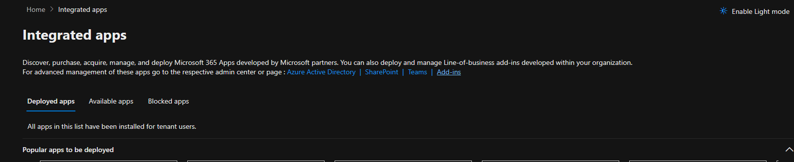
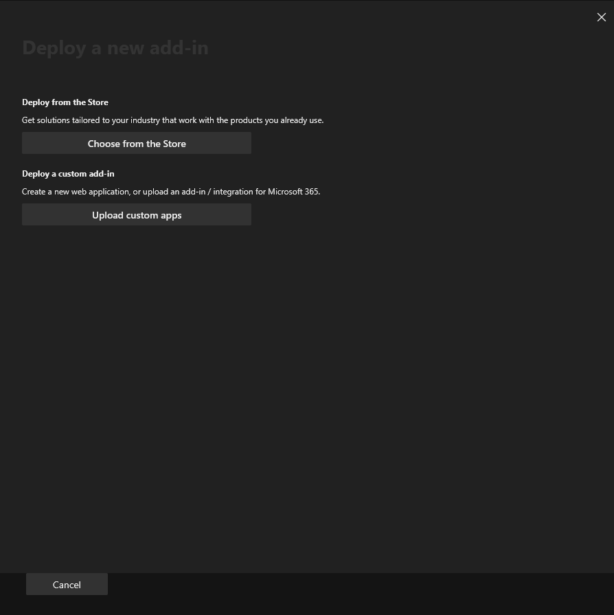

# Microsoft Ribbon Phishing Reporter

The **Microsoft** **Ribbon** **Phishing** **Reporter** allows your users to easily report suspicious emails and help protect your organization from cyberattacks. When you integrate the Phishing Reporter with Microsoft's integrated spam-reporting feature, the Phishing Reporter will appear in the Outlook ribbon.&#x20;

When your users click the Phishing Reporter to report an email, they can provide your IT team with an early warning about potential threats. You can receive reported emails in the Microsoft 365 Defender platform and the Keepnet Incident Responder page.&#x20;

To learn how to install the Microsoft Ribbon Phishing Reporter and how your users can use the Phishing Reporter in their mail clients, see the sections below.

If you use the phishing feature in the Keepnet Incident Responder menu, the Microsoft Ribbon Phishing Reporter will also track if your users report our simulated phishing emails. You can use this feature to see which users successfully identify potential threats.

## Microsoft Ribbon Phishing Reporter User Experience

Here is an example view of the ribbon phishing reporter on Outlook.

<figure><figcaption></figcaption></figure>

* When using the new Outlook Ribbon, clicking the Phishing Report button opens a pop-up window instead of a side panel.

<figure><figcaption></figcaption></figure>

* The pop-up provides the same reporting options but appears as a temporary dialog in the center of the screen.
* This is the default experience for some Outlook versions, including Outlook on Windows with the new Ribbon UI.

### Supported clients

The following table identifies which Outlook clients support the integrated spam-reporting feature. See the [full list here from Microsoft official documentation](https://learn.microsoft.com/en-us/office/dev/add-ins/outlook/spam-reporting?tabs=jsonmanifest#supported-clients).

| Client                                                                                                                                                     | Status                                                                                                                                                                                                                                                                                                                                                                                  |
| ---------------------------------------------------------------------------------------------------------------------------------------------------------- | --------------------------------------------------------------------------------------------------------------------------------------------------------------------------------------------------------------------------------------------------------------------------------------------------------------------------------------------------------------------------------------- |
| Outlook on the web                                                                                                                                         | <mark style="color:green;">**Supported\***</mark>                                                                                                                                                                                                                                                                                                                                       |
| [New Outlook on Windows](https://support.microsoft.com/en-us/office/getting-started-with-the-new-outlook-for-windows-656bb8d9-5a60-49b2-a98b-ba7822bc7627) | <mark style="color:green;">**Supported\***</mark>                                                                                                                                                                                                                                                                                                                                       |
| 
Classic Outlook on Windows

Version 2404 (Build 17530.15000)
                                                                                   | <mark style="color:green;">**Supported**</mark>                                                                                                                                                                                                                                                                                                                                         |
| 
Outlook on Mac

Version 16.81 (23121700) or later
                                                                                              | 
<mark style="color:orange;"><strong>Only in</strong></mark> <mark style="color:orange;"><strong>Preview, Not Fully Functional</strong></mark> (see <a href="https://learn.microsoft.com/en-us/office/dev/add-ins/outlook/spam-reporting#preview-the-integrated-spam-reporting-feature-in-outlook-on-mac">Preview the integrated spam-reporting feature in Outlook on Mac</a>)
 |
| Outlook on Android                                                                                                                                         | <mark style="color:red;">**Not available**</mark>                                                                                                                                                                                                                                                                                                                                       |
| Outlook on iOS                                                                                                                                             | <mark style="color:red;">**Not available**</mark>                                                                                                                                                                                                                                                                                                                                       |


\* In Outlook on the web and the new Outlook on Windows, the integrated spam-reporting feature isn't supported for [Microsoft 365 consumer accounts](https://support.microsoft.com/en-us/account-billing/what-s-the-difference-between-a-microsoft-account-and-a-work-or-school-account-72f10e1e-cab8-4950-a8da-7c45339575b0). Microsoft 365 Consumer accounts ([Outlook.com](http://outlook.com/), Hotmail, [Live.com](http://live.com/)) are for personal use and don’t support the integrated spam-reporting feature in Outlook on the web or the new Outlook on Windows.


### Prerequisites

Before you can install the Microsoft Ribbon Phishing Reporter for your organization, your organization will need to have a Microsoft 365 mail server and license. The Phishing Reporter is compatible with the above email clients and requirements.


The Microsoft Ribbon Phishing Reporter supports installation for [shared mailboxes](https://learn.microsoft.com/en-us/microsoft-365/admin/email/about-shared-mailboxes?view=o365-worldwide). This feature requires that Graph API and Nested App Authentication single sign-on (NAA-SSO) permissions are authorized in your Microsoft 365 tenant. See installation steps 5 through 9 below for how to authorize these permissions.


### How to Install the Microsoft Ribbon Phishing Reporter&#x20;

1. Customize [Phishing Reporter](../phishing-reporter-customization.md) for your organization's needs
2. Go to **Phishing Reporter,** scroll down to the bottom and click the **Manage and Download** button.
3. Click '**Authorize'** for **Delegated Access** permissions.


Suggested to authorize **Application-Level Access** only for organizations using Conditional Access or Advanced Identity Policies, since managed device or policy restrictions may cause token acquisition to fail when using delegated permissions.


<figure><figcaption></figcaption></figure>

3. Log in to your Microsoft 365 account using your admin credentials.
4. Once you log in, the **Permissions** **requested** pop-up window will display. Read the permissions, then click **Accept**.

<figure><figcaption></figcaption></figure>

5. Once you accept the permissions, the GRAPH APIs Authorization Successful window will display.

<figure><figcaption></figcaption></figure>

6. Click the **Download** icon below the **Microsoft** **Ribbon** **Phishing** **Reporter** option to download the **PhishingReporterRibbon.xml** file.
7. In a new tab of your browser, log in to your **Microsoft 365 admin center**.

<figure><figcaption></figcaption></figure>

8. From the menu on the left side of the page, click **Settings**.
9. From the **Settings** drop-down menu, select **Integrated** **apps**.

<figure><figcaption></figcaption></figure>

10. Click Add-ins at the top-right corner of the page. The Add-ins page will open

<figure><figcaption></figcaption></figure>

11. On the Add-ins page, click Deploy Add-In. The Deploy a new add-in pop-up window will open.

<figure><figcaption></figcaption></figure>

12. In the pop-up window, click Next.

<figure><figcaption></figcaption></figure>

13. Click Upload custom apps.

<figure><figcaption></figcaption></figure>

14. Select the **I have the manifest file (.xml) on this device** option. Then, click **Choose** **File** and select the **PhishingReporterRibbon.xml** file that you downloaded in step 6.

<figure><figcaption></figcaption></figure>

15. Click **Upload** to install the Phishing Reporter. The **Configure** **add-in** pop-up window will open.

<figure><figcaption></figcaption></figure>

16. From the pop-up window, select which users will have access to the Phishing Reporter and which method you would like to use to deploy the Phishing Reporter.

<figure><figcaption></figcaption></figure>


We recommend that you allow all users to access the Phishing Reporter. We also recommend that you use the Fixed deployment method.


17. Click **Next**, and additional app permissions will display.
18. Once you have read the permissions, click **Save**. The **Deploy** Phishing Reporter pop-up window will open.

<figure><figcaption></figcaption></figure>


The expected timeframe for the Phishing Reporter to deploy is 24 hours, but timeframes can vary. For more information about deploying add-ins, see Microsoft's [Deploy add-ins in the Microsoft 365 admin center](https://learn.microsoft.com/en-us/microsoft-365/admin/manage/manage-deployment-of-add-ins?view=o365-worldwide#deploy-an-office-add-in-using-the-admin-center) article.


19. Once the pop-up window displays a confirmation that the add-in successfully deployed, click **Next**. The **Announce** **add-in** pop-up window will open and display a message about announcement recommendations from Microsoft.

<figure><figcaption></figcaption></figure>


After you install and deploy the Phishing Reporter, you might receive an email from your mail service provider that contains information you can use to help you announce the Phishing Reporter add-in to your users. Keepnet does not send the email about the Phishing Reporter’s intended usage and benefits.


20. Click Close to close the pop-up window.

## Troubleshooting Microsoft Ribbon Phishing Reporter

### We were unable to process this item. Please try again later.

**"We were unable to process this item. Please try again later."** message in the Ribbon Phishing Reporter in Outlook.

<figure><figcaption></figcaption></figure>

<figure><figcaption>
<strong>We were unable to process this item issue on Microsoft Ribbon Phishing Reporter</strong>
</figcaption></figure>

The suggested solution is to "[Toggling on New Outlook](https://support.microsoft.com/en-gb/office/toggle-out-of-the-new-outlook-for-windows-ec102b39-5727-418e-ae1f-a1805434640c)"

<figure><figcaption>
Toggling on New Outlook
</figcaption></figure>

It is recommended because:

1. **Compatibility Issues with Classic Outlook**

* The Microsoft Ribbon Phishing Reporter add-in might not be fully supported or optimized in the classic (legacy) Outlook for Windows **except Version 2404 (Build 17530.15000).** See [Supported Clients](microsoft-ribbon-phishing-reporter.md#supported-clients)
* Microsoft is shifting support toward New Outlook, which has improved integration with cloud-based services and add-ins.

2. **Performance & Connectivity Fixes in New Outlook**

* New Outlook is built on a web-based architecture, offering better compatibility with Microsoft 365 cloud services, including phishing reporting.
* It resolves time-out errors caused by outdated local add-in frameworks.

3. **Bug Fixes & Updates**

* Microsoft frequently updates the New Outlook, while the classic version may have outdated code that affects add-in performance.

4. **Cloud Integration & Service Connectivity**

* The Phishing Reporter add-in relies on Microsoft 365 cloud APIs to submit reports.
* If the classic Outlook version struggles with these connections, switching to the New Outlook can ensure a more stable connection.

**Try Enabling "New Outlook"** as suggested.

### Troubleshooting: Microsoft Graph Authentication Error (AADSTS530004)

The following issue occurs because **Microsoft Conditional Access** requires devices or sessions to be compliant before granting access to protected resources. When the **Keepnet Phishing Reporter** **add-in** attempts to connect via **Delegated Access** (i.e., on behalf of a signed-in user), the organization’s Conditional Access policies may block the request if it does not originate from a compliant or trusted device.

This is common when:

* The organization enforces device compliance via Intune or Azure AD.
* The user accessing the Phishing Reporter add-in is considered an external identity.

<figure><figcaption></figcaption></figure>

#### What Is Application-Level Access?

**Application-level permissions** allow the **Keepnet Phishing Reporter add-in** to access Microsoft 365 mailboxes and perform phishing reporting tasks **without requiring a signed-in user**. The add-in authenticates using its own identity instead of a user’s.

When enabled, the Phishing Reporter add-in acts as a **trusted service** with organization-wide permissions granted by an administrator. This ensures that Keepnet can operate under Conditional Access, perform automated operations, and maintain consistent behavior even when users are not logged in.

#### Delegated vs Application-Level Access

<table><thead><tr><th width="140.97265625">Access Type</th><th width="213.6640625">Description</th><th width="131.3828125">Scope</th><th>Typical Use Case</th></tr></thead><tbody><tr><td>Delegated Access</td><td>Add-in acts on behalf of a user, limited by that user’s permissions.</td><td>User-based</td><td>When a user reports a phishing email from Outlook.</td></tr><tr><td>Application-Level Access</td><td>Add-in acts as itself, using admin-granted permissions.</td><td>Tenant-wide</td><td>When the Phishing Reporter add-in performs identity mapping, mailbox scans, or Conditional Access operations.</td></tr></tbody></table>

#### Why Application-Level Access Is Required

If your organization enforces **Conditional Access**, **device compliance**, or **automated identity** **checks**, Delegated Access will fail because it depends on the user’s compliance state.

**Application-Level Access** ensures:

* **Uninterrupted operation** of the Phishing Reporter add-in across all mailboxes.
* **Centralized and consistent access** across departments and tenants.
* **Secure authentication** compatible with Conditional Access requirements.

#### When to Use Application-Level Access

Use Application-Level Access if:

* You require organization-wide authentication for all users.
* Conditional Access or advanced identity enforcement is active.
* Consistency across departments/regions is needed.

#### Security Notes

* **Admin Consent Required:** Only global administrators can grant Application-Level permissions.
* **Least Privilege Principle:** Assign only the permissions needed for the Phishing Reporter add-in to operate.
* **Governance:** Regularly audit app-only permissions to ensure compliance.

#### Keepnet Recommendation

Use **Application-Level Access** for:

* Reliable, organization-wide authentication and identity mapping.
* Compatibility with Conditional Access and advanced identity controls.

Keep **Delegated Access** for:

* End-user actions like phishing report submission from the Outlook ribbon.

#### Additional References

* [Microsoft Docs: Conditional Access and Compliant Devices](https://learn.microsoft.com/en-us/entra/identity/conditional-access/policy-all-users-device-compliance)
* [Microsoft Docs: On-Behalf-Of Flow](https://learn.microsoft.com/en-us/entra/identity-platform/v2-oauth2-on-behalf-of-flow)

#### Summary

This error (AADSTS530004) indicates that your Microsoft 365 tenant blocks delegated access under Conditional Access rules.

To resolve it, configure Application-Level Access (App-only) for the Keepnet Phishing Reporter add-in and reauthorize the application with admin consent

## How Microsoft Ribbon Phishing Reporter Buttons Look on Outlook Platforms

**Microsoft Ribbon Phishing Reporter** helps users report suspicious emails quickly and easily across multiple email platforms. This section visually showcases how the Phishing Reporter button appears in different environments—**Outlook Desktop (New/Classic)**, **Outlook Web (OWA)**, **Outlook on** **Mac**, **Mobile (IOS/Android)**.

### New Outlook

In the redesigned **New Outlook** interface, the Phishing Reporter button is placed conveniently in the top toolbar when viewing an email.

1. Open your **Inbox**.
2. Select the suspicious email.
3. Click the **Phishing Reporter** button in the toolbar at the top.

<figure><figcaption></figcaption></figure>

### Classic Outlook

In **Classic Outlook**, the reporter button is accessible directly from the ribbon while reading or previewing an email.

1. Click **Inbox** from your folder list.
2. Open the email you want to report.
3. Click the **Phishing Reporter** button on the ribbon toolbar.

<figure><figcaption></figcaption></figure>

### Outlook Web App (OWA)

If you’re using **Outlook on the web**, the reporter button is clearly visible in the action toolbar when viewing a message.

1. Go to your **Inbox**.
2. Open the suspicious email.
3. Click the **Phishing Reporter** icon in the top menu.

<figure><figcaption></figcaption></figure>

### Outlook for Mac

For **Outlook on macOS**, the reporter button is available under the **Report** dropdown.

1. Select the email in your **Inbox**.
2. Click the **Report** dropdown from the top toolbar.
3. Choose **Phishing Reporter**.

<figure><figcaption></figcaption></figure>

### Outlook Mobile (iOS / Android)

The mobile version of Outlook provides access to the reporter through the contextual options menu:

1. While viewing a suspicious email, tap the **three dots** (•••) in the upper-right.
2. Tap on the **Suspicious Email Reporter** icon.

<figure><figcaption></figcaption></figure>

## Frequently Asked Questions (FAQs)

### Q: Can I show a confirmation prompt before deleting a reported email?

A: No, Microsoft Ribbon Phishing Reporter automatically deletes the reported email and does not provide an option to prompt employees for confirmation before deletion.

### Q: Does the Ribbon work on Outlook Mobile for iPhone or Android?

A: As of March 2025, Microsoft does not support Outlook Mobile. Please refer to the supported clients list for updates: [Supported Clients](https://doc.keepnetlabs.com/next-generation-product/platform/phishing-reporter/phishing-reporter-deployment/microsoft-ribbon-phishing-reporter#supported-clients)

### Q: Can I change the window size of the Ribbon message (e.g., set a fixed width and height)?

A: No, Microsoft does not allow modifications to the pop-up box. Its size is automatically adjusted.

### Q: Can I provide a language selection option for users to choose their preferred language for pop-up messages?

A: No, Microsoft does not support adding a language selection option within the pop-up. The language is automatically set based on the user’s Outlook language settings.

### Q: I see the Microsoft Ribbon Phishing Reporter in Outlook Desktop on my MacBook, but it doesn't work. Why?

A: Microsoft currently provides the Ribbon Phishing Reporter for preview purposes only on Outlook Desktop for Mac. While it may be visible, it is not fully functional. Please refer to the supported clients list for details: [Supported Clients](https://doc.keepnetlabs.com/next-generation-product/platform/phishing-reporter/phishing-reporter-deployment/microsoft-ribbon-phishing-reporter#supported-clients)

### Q: If Microsoft automatically deletes the reported email, can it be recovered?

A: Yes, after an email is reported, Microsoft displays a message confirming its deletion. This message includes an "Undo" option, allowing employees to recover the reported email if needed.

### **Q: Can I use the Ribbon Add-in and Page View Add-in together?**

A: Yes, you can deploy both of them, and your employees can use either the Ribbon Add-in or the Page View Add-in based on their preference.

### **Q: Why can't I report multiple emails at the same time in Classic Outlook on Windows?**

A: In **classic Outlook on Windows**, the **Phishing Reporter** processes one reported message at a time. If you attempt to report another email while the first one is still being processed, a **notification dialog** will appear, informing you that the previous report is still in progress.

To report multiple emails, please wait for the current report to complete before submitting the next one. This limitation ensures that each report is properly processed without conflicts.

### Q: What Permissions are Required for Microsoft Graph API&#x20;

A: The **Microsoft Ribbon Phishing Reporter** requires specific Microsoft Graph API permissions to function effectively within an organization’s Microsoft 365 environment. These permissions allow the application to interact with users’ emails, retrieve necessary details for reporting phishing attempts, and ensure smooth integration with the email infrastructure.&#x20;

Below is a breakdown of the permissions required and their purpose:

**1. Mail Permissions**

* **Mail.Read**: Allows the Phishing Reporter to read the user’s email to retrieve necessary email details such as headers, attachments, and content.
* **Mail.Read.Shared**: Extends read access to shared mailboxes, ensuring that the application can retrieve phishing emails reported from shared accounts.
* **Mail.ReadWrite**: Provides both read and write access to the user’s mailbox, enabling modifications or tagging of emails as needed.
* **Mail.ReadWrite.Shared**: Extends read and write permissions to shared mailboxes for better handling of phishing reports.
* **Mail.Send**: Enables the application to send emails, which may be necessary when forwarding reported phishing emails.
* **Mail.Send.Shared**: Allows the application to send emails from shared mailboxes when the user has the appropriate permissions.

**2. User Profile Permissions**

* **profile**: Allows the Microsoft Ribbon Phishing Reporter to retrieve basic user profile information, ensuring accurate reporting and tracking.

## Tutorial Video

This video tutorial shows the documentation steps for deploying Microsoft Ribbon Phishing Reporter add-in on M365.


