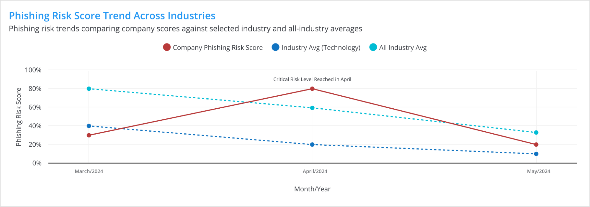
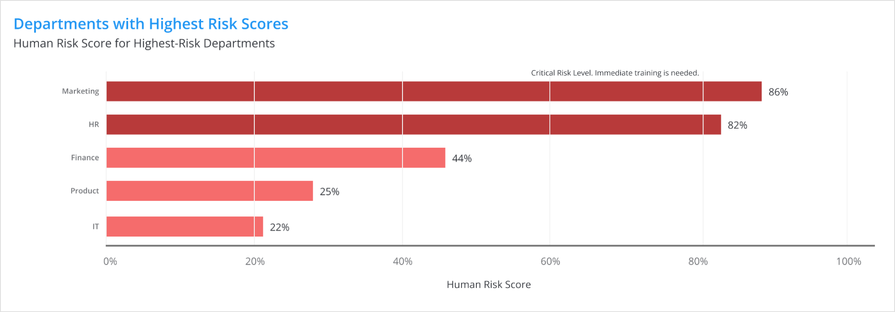
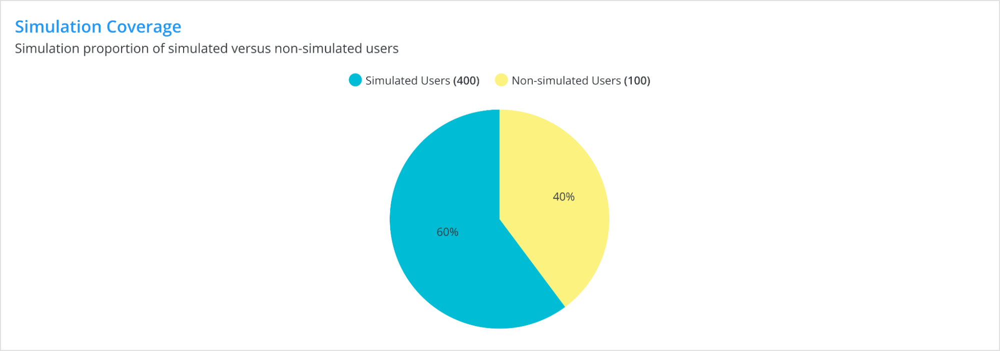
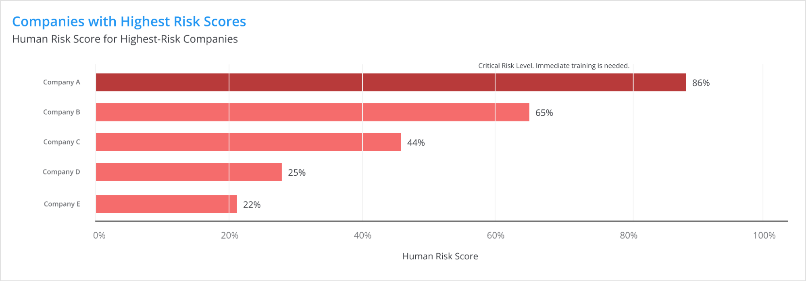
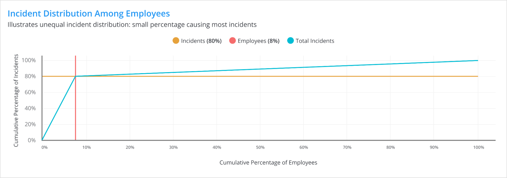

# Executive Reports

**Keepnet Executive Reports** offer clear and high-level summaries designed to give executives important insights and actionable data about their organization’s security posture. What makes Keepnet unique is our use of data storytelling. Instead of just showing numbers and statistics, we turn complex security data into simple, meaningful stories that highlight important trends, risks, and opportunities.

Our reports follow a clear structure. This way, decision-makers can quickly see what the data means and why it’s important. By telling the story behind the data, we help executives make smart decisions and ensure their cybersecurity efforts support overall business goals.

## What We Include for Customers

Our Executive Reports focus on delivering clear, concise, and relevant information that supports decision-making, strategic planning, and risk management on the key points below:

* **Phishing Risk Analysis:** We provide a detailed examination of your organization’s phishing risk, comparing your performance against industry benchmarks. This includes tracking trends over time, identifying areas of improvement, and highlighting critical risks that require immediate attention.
* **Training Effectiveness:** Our reports assess the impact of security awareness training programs. We include metrics that measure user engagement, training completion rates, and the reduction in phishing risk scores following training interventions. This section aims to demonstrate the outcomes of the security training.
* **User Behavior and Reporting Trends:** Understanding user behavior is crucial in mitigating risks. We analyze how users interact with phishing simulations, their response times, and their reporting habits. This analysis helps identify users or departments needing additional training or support.
* **Incident Distribution and High-Risk Profiles:** The reports provide insights into how security incidents are distributed across your organization, highlighting high-risk individuals or departments. This helps prioritize security measures and allocate resources effectively.
* **Comparison Against Industry Averages:** We benchmark your organization’s performance against industry standards, offering a clear perspective on where you stand relative to your peers. This comparison helps identify competitive strengths and weaknesses.

## The Aim of Executive Reports

The primary aim of our Executive Reports is to empower our customers with the insights needed to drive strategic decisions that enhance their cybersecurity posture. These reports are designed to:

* **Inform Decision-Making:** Provide executives with the data they need to make informed decisions about security investments, policy adjustments, and risk management strategies.
* **Highlight Risks and Opportunities:** Identify potential vulnerabilities, high-risk areas, and opportunities for improvement to help you stay ahead of emerging threats.
* **Support Compliance and Governance:** Ensure that your organization meets regulatory requirements and internal governance standards by providing documented evidence of your security efforts.
* **Track Progress Over Time:** Offer a historical perspective on your security metrics, allowing you to track improvements and the impact of your security initiatives over time.
* **Foster a Security-First Culture:** By presenting clear and actionable data, our Executive Reports help foster a culture of security awareness throughout your organization, from the executive level to individual employees.

Our Executive Reports are more than just a summary; they are a strategic tool designed to guide your organization toward a more secure future. By focusing on the most critical aspects of your security posture, we help you prioritize actions, allocate resources efficiently, and ensure that your organization remains resilient in the face of evolving cyber threats.

## Example Executive Report PDF

Here is an example **Executive Report** showing the **Phishing Simulation, Security Awareness Training, Suspicious Email Reporting, and Security Culture Score** metrics over time for your organisation.



## Understanding Graphics in the Executive Report

In the Executive Report, visual representations are essential for simplifying complex data and presenting it in a clear, actionable way. These graphics highlight key metrics, trends, and comparisons that are important for informed decision-making.&#x20;

In this section, we will explain how to interpret these visuals, ensuring that you can effectively use the insights they provide to support strategic decisions and drive meaningful actions.

### Phishing Risk Score Trend Across Industries

This graphic compares your company's phishing risk score with the average scores in your industry and across all industries. The red line shows your company's score over time, while the blue and teal lines show the average scores for your sector and all industries.

<figure><figcaption></figcaption></figure>

This chart is important because it helps you see how your company's phishing risk compares to others. If your company's score is higher than the industry or all-industry average, it means your company might be more vulnerable to phishing attacks and needs to improve its security.&#x20;

Understanding this graphic helps you decide where to focus your security efforts. For example, if your score is higher than the industry average, it might be time to invest in more training.&#x20;

The benefit of using this graphic is that it gives you a clear picture of your company's phishing risk compared to others, helping you make smart decisions to protect your business from phishing attacks.

### Training Completion

This graphic shows how well the training program is being completed across the company. You can see different types of charts representing the percentage of users, as well as the various stages of training: Completed, In Progress, and Incomplete.

<figure><figcaption></figcaption></figure>

<figure><figcaption></figcaption></figure>

<figure><figcaption></figcaption></figure>

This uses donut, pie, or bar chart styles to show users' training status across the company.&#x20;

This chart is important because it gives you a quick overview of how many employees have finished the required training, how many are still working on it, and how many have not started or completed it. If most users have an "Incomplete" status, it suggests that the training program might need more attention or better communication to ensure everyone participates.

By understanding this graphic, you can take steps to improve training completion rates, such as sending reminders, offering additional support, or making adjustments to the training schedule.&#x20;

The benefit of using this chart is that it allows you to monitor the progress of your training program and ensure that all employees receive the necessary education to protect the company from potential security risks.

### Phishing Dwell Time and Quickest Response Time

This graphic illustrates the average time users take to identify and respond to phishing attempts across multiple campaigns. The vertical axis represents the time in minutes, and the horizontal axis shows different phishing campaigns.&#x20;

<figure><figcaption></figcaption></figure>

The chart compares the "Dwell Time Avg," which is the average time users took to respond, with the "Quickest Response" recorded during each campaign.

This chart is important because it helps your organization measure how quickly phishing attempts are detected and addressed by users. A shorter dwell time indicates that users are identifying and responding to phishing threats promptly, which is important for minimizing the potential impact of such attacks. Conversely, longer dwell times suggest that users need additional training to recognize phishing attempts more quickly.

Understanding this graphic allows you to assess the effectiveness of your phishing simulations and identify areas where response times need to be improved. By analyzing these trends, you can determine if certain campaigns are more challenging for users and adjust your training strategies accordingly.

The benefit of using this graphic is that it provides a clear visual representation of how well your users are performing in detecting phishing attempts. This information can guide your decisions on where to focus training efforts, ultimately helping to reduce the risk of successful phishing attacks in your organization.

### Phishing Dwell Time Distribution

The "Phishing Dwell Time Distribution" graph shows how long users engage with phishing simulation emails before responding, reporting, or falling victim. The X-axis displays dwell time in minutes (0 to 120), while the Y-axis represents the percentage of users. Most users engage for less than 10 minutes, with fewer taking longer. The orange line marks the average dwell time of 25 minutes, indicating that, on average, users take this long to respond.

<figure><figcaption></figcaption></figure>

This graph helps assess an organization's vulnerability to phishing attacks by showing how quickly employees detect phishing attempts. If most users respond in under 25 minutes, it suggests good awareness, while longer times may indicate greater risk, requiring targeted training. Organizations can use this data to improve security awareness programs by focusing on users who take more time.

The graph's primary benefit is providing data-driven insights into employee susceptibility, allowing for personalized training. It also tracks improvement over time, helping organizations measure the effectiveness of their security initiatives and promoting a more security-conscious culture.

### &#x20;Users with Highest Risk Scores&#x20;

This graphic displays the human risk score for users who are considered at the highest risk within your organization. The horizontal bars represent individual users, with their corresponding risk scores as percentages. The red bars indicate that these users have reached a critical risk level, suggesting that immediate training is necessary to mitigate their risk.

<figure><figcaption></figcaption></figure>

This chart is important because it identifies specific individuals within your organization who are at the greatest risk of falling for phishing attempts. By highlighting these high-risk users, the chart allows you to prioritize training and intervention efforts where they are most needed. The goal is to reduce their risk scores and ensure that they are better equipped to recognize and avoid security threats.

Understanding this graphic helps your organization take targeted actions to improve overall security. By focusing on users with the highest risk scores, you can deliver tailored training and support to those who need it most, reducing the likelihood of successful phishing attacks and other security incidents.

The benefit of using this graphic is that it provides a clear and actionable overview of where your organization’s vulnerabilities lie, enabling you to take proactive measures to protect your company from potential threats.

### Industry Phishing Risk Score

This graphic shows a comparison between your company's phishing risk score and an industry average. The graph displays how user responses and report rates from phishing simulations compare against this industry benchmark. The blue dashed line represents the industry average phishing risk score, while the black line shows your company's phishing risk score for each campaign. The red bars indicate specific metrics related to phishing simulations, such as how many users were targeted and how many reported the phishing attempt.

<figure><figcaption></figcaption></figure>

This chart is important because it provides insights into how well your company is performing in phishing simulations compared to the industry standard. A higher risk score above the industry average suggests that your users are more susceptible to phishing attacks, which might indicate a need for enhanced training or additional security measures. Conversely, a lower risk score means that your company's phishing defenses are stronger than those of the average company in your industry.

Understanding this graphic helps your organization identify areas where improvements are needed, such as increasing user awareness or refining phishing simulation strategies. By tracking these metrics over time, you can monitor the effectiveness of your security awareness programs and adjust them as necessary to reduce the risk of successful phishing attacks.

The benefit of using this graphic is that it allows you to benchmark your company's phishing risk against industry standards, providing a clear view of where you stand and what actions might be needed to enhance your overall security posture.

This graphic displays the human risk score for users who are considered at the highest risk within your organization. The horizontal bars represent individual users, with their corresponding risk scores shown as percentages. The red bars indicate that these users have reached a critical risk level, suggesting that immediate training is necessary to mitigate their risk.

### Departments with Highest Risk Scores

This graphic shows the human risk scores for various departments within your organization, highlighting those that are considered at the highest risk. Each bar represents a different department, with the length of the bar indicating the department’s risk score as a percentage. The red bars signal that these departments have reached a critical risk level, suggesting that immediate training is necessary to mitigate their risk.

<figure><figcaption></figcaption></figure>

This chart is important because it identifies specific departments within your organization that are most vulnerable to security threats, such as phishing. By pinpointing these high-risk departments, the chart allows you to prioritize training and intervention efforts where they are most needed, ensuring that these departments receive the attention required to lower their risk levels.

Understanding this graphic helps your organization take targeted actions to improve overall security. By focusing on departments with the highest risk scores, you can deliver tailored training and support, thereby reducing the likelihood of successful security breaches originating from these areas.

The benefit of using this graphic is that it provides a clear and actionable overview of where your organization’s vulnerabilities lie, enabling you to take proactive measures to protect your company from potential threats.

### Simulation Coverage

This graphic displays the proportion of users who have been included in phishing simulations versus those who have not. It can be a pie chart or a bar chart, both illustrating the same data. The big blue section represents the simulated users, while the small yellow section represents the non-simulated users.

<figure><figcaption></figcaption></figure>

<figure><figcaption></figcaption></figure>

This chart is important because it highlights the extent of coverage your phishing simulation program has within your organization.&#x20;

The benefit of using this graphic is that it provides a clear visual representation of how many users are being actively engaged in your phishing simulation efforts. It helps you make informed decisions about scaling up your simulation program to improve overall organizational readiness against phishing attacks.

### Repeat Offenders Users (Threshold: 2)

This graphic shows the percentage of users who have repeatedly fallen for phishing simulations, defined here as having failed at least twice. It can be in different visualizations—a stacked bar chart and a pie chart—that represent the same data. The red portion represents repeat offenders, while the blue portion shows all simulated users.

<figure><figcaption></figcaption></figure>

<figure><figcaption></figcaption></figure>

This chart is important because it highlights a specific group of users within your organization who are at higher risk due to their repeated failure to recognize phishing attempts. The small percentage of repeat offenders compared to the total number of simulated users indicates how many individuals might require additional training or intervention to improve their ability to detect phishing threats.

Understanding this graphic helps your organization identify users who may need more focused attention in your security awareness training programs. By isolating those who have repeatedly fallen for phishing simulations, you can provide them with additional resources or personalized training to help reduce their susceptibility to phishing attacks.

The benefit of using this graphic is that it offers a clear and focused view of the most vulnerable users in your organization.&#x20;

### Phishing Simulation Repeat Offenders Rate

This chart helps organizations track and reduce repeat offenders of phishing simulations. By identifying these users, it strengthens cybersecurity awareness and mitigates phishing risks.

<figure><figcaption></figcaption></figure>

**What Is It?**

This widget provides a visual representation of two key metrics:

1. **Current Level**: This indicates the percentage of users within your organization who have been identified as repeat offenders during phishing simulations. Repeat offenders are users who have failed phishing simulations more than once.
2. **Protection Level Agreement (PLA)**: This is a benchmark set at a static 5% to help organizations aim for an optimal level of security awareness by minimizing repeat offenders. Learn more about PLA [here](https://keepnetlabs.com/blog/what-is-the-protection-level-agreement-in-security-awareness-training).

**Why Is It Important?**

Repeat offenders pose a significant risk to an organization’s security because they are more likely to fall for real phishing attacks. The widget helps organizations:

* Identify areas where additional training or awareness campaigns are required.
* Reduce the risk of successful phishing attacks by lowering the number of repeat offenders.
* Track progress over time to ensure continuous improvement in security awareness.

This chart is a powerful tool for organizations to identify, monitor, and reduce repeat phishing simulation offenders. By tracking these metrics, organizations can take actionable steps to improve their employees' cybersecurity awareness and mitigate the risk of real phishing attacks.

### Companies with Highest Risk Scores

This graphic displays the human risk scores for various companies, highlighting those with the highest risk levels. Each bar represents a different company, with the length of the bar indicating the company's risk score as a percentage. The red bars signify that these companies have reached a critical risk level, suggesting that immediate training is necessary to mitigate their risk.&#x20;

<figure><figcaption></figcaption></figure>

This chart is important because it identifies specific companies that are most vulnerable to security threats. High-risk scores indicate that these companies are at greater risk of falling victim to phishing attacks or other cybersecurity threats. By pinpointing these high-risk companies, the chart allows for the prioritization of training and intervention efforts to reduce their risk levels.

Understanding this graphic helps organizations take targeted actions to improve overall security. By focusing on companies with the highest risk scores, you can deliver tailored training and support to help these organizations better recognize and respond to security threats.

The benefit of using this graphic is that it provides a clear and actionable overview of where vulnerabilities lie across different companies, enabling you to take proactive measures to protect these organizations from potential threats.

### Impact of Phishing Awareness Training&#x20;

This graphic demonstrates how phishing risk scores have evolved over time within your organization following a 12-month cybersecurity training program. The vertical axis represents the phishing risk score, while the horizontal axis tracks the score across various months. The dashed blue line indicates the industry average phishing risk score, serving as a benchmark to compare your company's performance.

<figure><figcaption></figcaption></figure>

The bars in the chart are color-coded to show different levels of risk over time. Red bars represent higher risk scores at the start of the training, yellow bars indicate moderate risk, and green bars signify lower risk as the training progresses. The chart also provides average risk scores for different three-month intervals, allowing you to see the overall trend in your organization's phishing risk.

This chart is important because it visually illustrates the effectiveness of your phishing awareness training. The downward trend from red to green bars suggests that the training program has successfully reduced the organization’s phishing risk over time. The closer your company's risk score gets to or falls below the industry average, the more effective the training program has been.

Understanding this graphic allows you to assess the long-term impact of your security awareness initiatives. If the chart shows a consistent decrease in risk, it validates the training's effectiveness. However, if the risk remains high or increases, it may indicate that the training needs to be adjusted or reinforced.

The benefit of using this graphic is that it provides a clear and comprehensive overview of your organization’s progress in reducing phishing risk. It helps you make informed decisions about future training strategies and ensures that your organization remains vigilant against phishing threats.

### Users' Time to Failure

This presents the average response times of users who clicked on phishing links and submitted data during phishing simulations. The horizontal axis shows the number of users, while the vertical axis represents the time to respond in seconds. The bars are divided into two segments: the lighter red section indicates users who clicked on the phishing link, and the darker red section represents those who also submitted data.

<figure><figcaption></figcaption></figure>

The chart also includes two important benchmark lines. The blue dashed line shows the company’s average response time for link clicks and data submission, while the yellow dashed line represents the industry average. The position of these lines relative to the bars provides insight into how quickly your users are being phished compared to the industry average.

This chart is important because it highlights how quickly users are falling for phishing attempts, both in terms of clicking the link and submitting sensitive information. A shorter time to failure indicates that users are being phished more quickly, which may suggest a need for stronger or more frequent training. Conversely, if users are taking longer to click or submit data, it could indicate improved awareness and caution.

The benefit of using this graphic is that it provides a clear visual representation of user behavior during phishing simulations, helping you identify vulnerabilities and make informed decisions to improve your organization’s overall security posture. By addressing these issues, you can reduce the likelihood of users falling for phishing attempts in the future.

### Phishing Report Rates Over Time

This graphic tracks the reporting rates from phishing simulations, comparing users who clicked on phishing links with those who did not over a three-month period. The vertical axis represents the phishing report rate, while the horizontal axis shows different months of the year.

<figure><figcaption></figcaption></figure>

The stacked bar chart is divided into three segments: the green section represents users who did not click on the phishing link but reported the phishing attempt, the red section indicates users who clicked on the phishing link, and the gray section shows users who did not report the phishing attempt at all.

This chart is important because it provides a clear view of how user behavior and reporting practices have changed over time. For example, a higher percentage of gray indicates a larger number of users who failed to report phishing attempts, which could signal the need for additional training or awareness campaigns. Conversely, if the green segment grows over time, it shows that more users are correctly identifying and reporting phishing simulations, reflecting an improvement in security awareness.

Understanding this graphic allows your organization to monitor the effectiveness of your phishing simulation training and to identify trends in user behavior. If reporting practices have improved over time, as suggested by an increase in the green and red segments, it indicates that users are becoming more vigilant. However, a decrease in reporting, as indicated by a rise in the gray segment, would suggest the need for further intervention.

The benefit of using this graphic is that it provides a clear, time-based overview of how well your users are responding to phishing simulations. This information helps you identify areas where additional training might be needed and allows you to track the impact of your efforts to improve security awareness over time.

### Total Reported Suspicious Emails and Percentage

These graphic presents the reporting rates of suspicious emails across different categories. It can be a bar chart, or  a pie chart that display the same data. The categories include "Undetected," "Malicious," "Phishing," and "Simulation."

<figure><figcaption></figcaption></figure>

<figure><figcaption></figcaption></figure>

<figure><figcaption></figcaption></figure>

This chart is important because it provides a clear overview of how well users are identifying and reporting different types of suspicious emails. The higher reporting rates for phishing and simulation emails suggest that users are generally aware and responsive to potential threats. However, the presence of undetected emails highlights a potential area for improvement in user awareness or training.

The benefit of using these graphics is that they provide actionable insights into user behavior regarding email security, allowing you to target training efforts more effectively and improve the overall security posture of your organization.

### Incident Distribution Among Employees

This graphic demonstrates how a small percentage of employees are responsible for the majority of security incidents within an organization. The graph uses total percentages to highlight the disproportionate distribution of incidents. It shows the percentages  of incidents caused by employees, represented by the intersection of the gold and red lines. The blue line represents the total incidents, indicating how incidents accumulate as more employees are considered.

<figure><figcaption></figcaption></figure>

This visualization is significant for identifying high-risk individuals within the organization, allowing for targeted training and interventions to reduce overall security risks. By understanding the data presented in this graph, you can allocate resources more effectively, focusing efforts on the small group of employees who contribute most to security incidents.

## Video Tutorial

This tutorial provides a detailed description of the Executive Reports product. You can understand the basic functions of the Executive Reports page and use the Executive Reports by following this tutorial.



## **FAQ**

### **Q: Do Executive Reports Include Bot Activity Data?**

A: Bot Activity data is excluded to ensure that the data reflects genuine human engagement and provides accurate insights.
