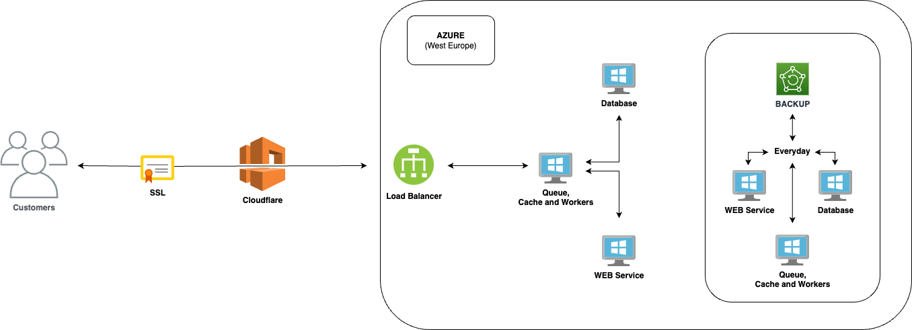

# Platform Security

## Introduction

Keepnet values customers' privacy and takes important steps to protect all customer data. Our main job is to keep any data secure. From this point of view, securing customers' data is one of the crucial jobs our company does. &#x20;

Keeping our systems and customers' data secure is vital to our operations and business. Please also review our [Privacy Policy](https://doc.keepnetlabs.com/legal-hub/for-everyone/website/privacy-policy).

## Information Security Team

Our Information Security team has the industry certifications detailed below.

## Trust & Safety, Transparency, and Abuse Policy

Keepnet is committed to maintaining a **secure, transparent, and responsible** cybersecurity ecosystem while ensuring compliance with industry standards and best practices.

* Customers can run phishing campaigns **only on their own and verified domains**, ensuring ethical and controlled testing.
* All **domains and IP addresses** used in phishing simulations are **dedicated to Keepnet** and managed securely.
* Keepnet enforces **strong security measures** on all IPs and domains, including **TLS encryption, DNSSEC, Bot Protection, WAF, and Firewall protections**, ensuring the integrity and security of our platform.
* All partners are continuously informed about **new phishing domains and IP addresses** to ensure none of our services are affected.
* Keepnet continuously monitors **phishing simulations, phone numbers, and content**, proactively updating security vendors, threat intelligence services, and companies.
* Keepnet also includes **identifiable markers in email headers and landing pages** to inform threat analysis tools that the activity is a **simulated phishing exercise**, promoting transparency and responsible testing.

## Certified and Transparent: Our Compliance Standards

Keepnet maintains rigorous compliance standards to ensure the integrity of its products and internal operating procedures. We are proud to continuously achieve ISO 27001, ISO 27017, ISO 27018, and ISO 42001:2023 certifications. Our adherence to these standards demonstrates our commitment to best practices and transparency.

## Keepnet ISO 27001

ISO 27001 is a global security standard that is recognized internationally for managing security risks to data. Certification to ISO 27001 proves that we are managing the information security in line with the security standards and adopting a process-based approach for establishing, implementing, operating, monitoring, maintaining, and improving  Information Security Management System.&#x20;


Download our ISO 27001 certificate.


## Keepnet ISO 27017

ISO/IEC 27017 is a standard created for cloud service providers and users to secure the cloud-based environment and minimize the potential risk of a security incident. This standard is designed to assist in the recommendation and implementation of controls for cloud-based organizations. This is relevant not only to organizations that store information in the cloud but also to providers which offer cloud-based services to other companies that may have sensitive information.


Download our ISO 27017 certificate.&#x20;


## Keepnet ISO 27018

ISO 27018 is the first international standard developed particularly for data privacy in the cloud. According to the [International Organization for Standardization (ISO)](https://www.iso.org/standard/76559.html), the purpose of this standard is to establish “commonly accepted control objectives, controls, and guidelines for implementing measures to protect Personally Identifiable Information (PII).” ISO 27018 defines best practices for information security management on the cloud. ISO 27018 adds new guidelines, enhancements, and security controls to the ISO/IEC 27001 and ISO/IEC 27002 standards, which help cloud service providers better manage the data security risks unique to PII in cloud computing.


Download our ISO 27018 certificate.&#x20;


## **Keepnet ISO/IEC 42001:2023**

ISO/IEC 42001:2023 establishes a framework for managing artificial intelligence systems responsibly within organizations. This international standard, developed by ISO and IEC, emphasizes ethics, risk management, transparency, and data integrity in AI operations. Keepnet's certification under ISO/IEC 42001:2023 reflects our commitment to maintaining the highest standards of data privacy and system reliability, ensuring that our AI solutions are both trustworthy and compliant with global regulations.



## Architecture

Keepnet's platform is designed for **high scalability, reliability, and security**, leveraging partnerships with **Cloudflare, Azure, and Amazon**. It operates on a globally distributed infrastructure, ensuring resilience and high availability.

* **Multi-cloud deployment** across AWS, Azure, and Cloudflare.
* **Microservices-based architecture** for efficient scaling.
* **Edge computing** through AWS CloudFront to optimize content delivery.
* **API-first design** enables seamless integrations with third-party tools.

## Data Center Location

### Microsoft Azure Data Center for the USA

Keepnet also hosts one of its other production environments within Microsoft Azure Cloud for the USA. Microsoft Azure Cloud uses the [Shared Responsibility Model](https://learn.microsoft.com/en-us/azure/security/fundamentals/shared-responsibility), and manages the cloud security.

<figure><figcaption>
Microsoft Azure - High-level Design for USA
</figcaption></figure>

Keepnet is responsible for security in the cloud, and you can find more details on the platform security page.

<table><thead><tr><th width="115.33333333333331" align="center">Product</th><th width="153" align="center">Production</th><th align="center">Disaster Recovery</th></tr></thead><tbody><tr><td align="center">Keepnet Products</td><td align="center">Microsoft Azure Data Center in Central US and East US 2</td><td align="center">
<strong>We use Microsoft Azure's Geo-restore</strong>

The geo-restore feature restores the server using geo-redundant backups. The backups are hosted in your server's <a href="https://learn.microsoft.com/en-us/azure/availability-zones/cross-region-replication-azure">paired region</a>. You can restore from these backups to any other region. The geo-restore creates a new server with the data from the backups. Learn more about geo-restore from the <a href="https://learn.microsoft.com/en-us/azure/postgresql/single-server/concepts-backup">backup and restore concepts article</a>.
</td></tr></tbody></table>

Keepnet has an on-premise installation that gives the ability to host the product in your own environment. Moreover, it is possible to host it on Google Cloud, Microsoft Azure, and any other virtualization platform. Please get in touch with us at support@keepnetlabs.com for any questions.

### Microsoft Azure Data Center for the UK and Europe

Keepnet hosts the production environment within Microsoft Azure Cloud in the UK and Europe. Microsoft Azure Cloud uses the [Shared Responsibility Model](https://learn.microsoft.com/en-us/azure/security/fundamentals/shared-responsibility), and manages the cloud security.

<figure><figcaption>
Microsoft Azure - High-level Design for the UK and Europe
</figcaption></figure>

Keepnet is responsible for security in the cloud, and you can find more details on platform security.

<table><thead><tr><th width="119.33333333333331" align="center">Product</th><th width="165" align="center">Production</th><th align="center">Disaster Recovery</th></tr></thead><tbody><tr><td align="center">Keepnet Products</td><td align="center">Microsoft Azure Data Center in the West and South of the UK</td><td align="center">
<strong>We use Microsoft Azure's Geo-restore</strong>

The geo-restore feature restores the server using geo-redundant backups. The backups are hosted in your server's <a href="https://learn.microsoft.com/en-us/azure/availability-zones/cross-region-replication-azure">paired region</a>. You can restore from these backups to any other region. The geo-restore creates a new server with the data from the backups. Learn more about geo-restore from the <a href="https://learn.microsoft.com/en-us/azure/postgresql/single-server/concepts-backup">backup and restore concepts article</a>.
</td></tr></tbody></table>

Keepnet has an on-premise installation that gives the ability to host the product in your own environment. Moreover, it is possible to host it on Google Cloud, Microsoft Azure, and any other virtualization platform. Please get in touch with us at support@keepnetlabs.com for any questions.

## Data in Transit

Keepnet leverages Cloudflare's advanced security services to protect data in transit. This includes full SSL encryption with TLS 1.2, which encrypts all data before it travels across the internet, ensuring that sensitive information remains secure from interception. Additional layers of security are provided by Cloudflare’s suite of features, including:

* **Web Application Firewall (WAF):** This firewall guards against common web exploits and vulnerabilities, ensuring that malicious traffic is blocked before reaching Keepnet's infrastructure.
* **Bot Protection:** This feature distinguishes between legitimate users and malicious bots, blocking harmful traffic while allowing genuine user access.
* **Javascript Challenge:** By issuing challenges that require the execution of Javascript, Keepnet can prevent automated attacks and ensure that only browsers capable of executing Javascript can access the site.
* **Data Loss Prevention (DLP):** This involves monitoring and controlling data transfers to prevent unauthorized data exfiltration.
* **DOS/DDOS Protection:** Cloudflare mitigates denial-of-service attacks, preserving availability and performance even under attack.
* **Captcha Features:** Captchas help distinguish human users from bots, adding an additional layer of security against automated attack tools.
* **DNSSEC Protection:** Keepnet has DNSSEC enabled for all domains, protecting users from DNS spoofing attacks by ensuring that DNS responses are authentic and have not been tampered with.

To further enhance security, Keepnet also implements the following protocols and controls:

* **HTTPS Protocols:** All traffic is served over HTTPS, which uses SSL/TLS encryption to create a secure channel over an insecure network.
* **Network Segmentation and Access Control:** This limits the reach of any potential intruder within the network and ensures that only authorized personnel have access to sensitive data.
* **Regular Security Audits and Compliance Checks:** Keepnet conducts regular audits to ensure that all security measures are effective and compliant with current standards and best practices.
* **Advanced Threat Intelligence:** Keepnet uses threat intelligence feeds to proactively identify and respond to new threats as they emerge, enhancing its adaptive security stance.

By integrating these advanced tools and rigorous policies, Keepnet ensures that all data in transit is well-protected against a wide range of digital threats, maintaining client data’s confidentiality, integrity, and availability.

## **Data at Rest Encryption Flow**&#x20;

We use  persisting encrypting/decrypting data.&#x20;

Data is encrypted/decrypted and persisted as encrypted on the database with Data Encryption Key. Without this key, the data can’t be visible as plain text.&#x20;

The Data Encryption Key is sent to the database by the Application to encrypt/decrypt data.

The encryption method is symmetric encryption with the AES-256 algorithm.&#x20;

The Data Encryption Key is a cryptography random string with a certain length salted with another random cryptographically string.

The data, like credentials, email addresses, and company names, are encrypted.

For more information about  encryption options, please check [this official guide](https://www.postgresql.org/docs/8.1/encryption-options.html).

## Data at Rest Encryption for Files

Keepnet has developed a new feature that automatically encrypts all files sent or uploaded to their platform using AES encryption. This feature provides enhanced security and ensures that all data stored on the platform is protected against unauthorized access, theft, and other security threats. Users do not need to take any additional action to protect their files, as the encryption process is automatic.

AES encryption is a widely used encryption algorithm that is considered to be highly secure and is widely used by governments, financial institutions, and other organizations that need to protect sensitive data. Keepnet's encryption feature uses AES encryption with a randomly generated key to encrypt files, which are stored on its servers. The files can only be accessed by authorized services with the correct decryption key. By using Keepnet's encryption feature, users can rest assured that their files are protected against security threats without needing to worry about any additional steps or features.

For more information, please [contact us](keepnet-support-help-desk.md).

## Policies

### Password Policy

We prioritize the security of our users' data. As part of our commitment to maintaining the highest security standards, we have implemented a robust password policy on our platform. This policy is designed to ensure that all user accounts remain secure from unauthorized access.

#### Password Complexity

We require all passwords to meet the following complexity requirements:

* **Length:** Passwords must be at least 8 characters long.
* **Character Types:** Passwords must include at least 1 uppercase letter, 1 lowercase letter, 1 number, and 1 special character (e.g., !, @, #, $, %, ^, &, \*).
* **No Personal Information:** Passwords should not contain any personal information such as your name, username, or date of birth.

#### Password Expiration

We understand that frequent password changes can sometimes lead to less secure behaviors, such as users choosing simpler passwords or reusing old ones. Therefore, we do not enforce a mandatory password expiration period. However, we strongly recommend that you change your password periodically and whenever you suspect that your account may have been compromised.&#x20;

Remember, choosing a unique and complex password and updating it regularly is one of the most effective ways to secure your account.

#### Account Lockout Policy

We prioritize user convenience while maintaining high-security standards. We understand that users may occasionally enter their passwords incorrectly. Therefore, we do not implement an account lockout policy after a certain number of unsuccessful login attempts.

#### Password Storage

We store passwords in a secure manner using modern cryptographic methods. All passwords are hashed and salted, ensuring that even in the unlikely event of a data breach, your password cannot be deciphered.

For more information, please click [here](compliance.md#next-generation-ui-data-encryption-flow).

#### Two-Factor Authentication (2FA)

We take the security of your account very seriously. To provide an additional layer of protection, we have implemented mandatory two-factor authentication (2FA) using Multi-Factor Authentication (MFA) for all accounts.&#x20;

When you log in, you'll be asked to enter a code from your MFA application in addition to your password. This ensures that even if someone else knows your password, they won't be able to access your account without the MFA code.

In the event that you can't access your MFA application, we provide an alternative method of authentication via SMS. You can receive a unique code on your registered mobile number, which you can use to access the platform.

Remember, keeping your MFA application and registered mobile number secure is crucial for the safety of your account.

#### Password Recovery

In case you forget your password, you can reset it using the "Forgot Password" option on the login page. An email will be sent to your registered email address with instructions on how to reset your password.

#### Summary

We encourage all users to follow these guidelines to ensure the security of their accounts. If you have any questions or need further assistance, please contact our support team.

Please note that this is a general password policy and may need to be adjusted based on your specific security requirements and standards.

### Information Security Policy

#### Overview

This top-level information security policy is a key component of our overall information security management framework and should be considered alongside more detailed information security documentation, including system-level security policies, security guidance, and protocols or procedures.&#x20;

#### Purpose

The objectives of our Information Security Policy are to preserve:

* Confidentiality - Access to Data shall be confined to those with the appropriate authority.
* Integrity – Information shall be complete and accurate. All systems, assets, and networks shall operate correctly, according to specifications.
* Availability - Information shall be available and delivered to the right person at the time when it is needed.

The aim of this policy is to establish and maintain the confidentiality, integrity, and availability of information owned or held by us by:

* Ensuring that all members of staff are aware of and fully comply with the relevant legislation as described in this and other policies.
* Describing the principles of security and explaining how they shall be implemented in the organization.
* Introducing a consistent approach to security, ensuring that all members of staff fully understand their own responsibilities.
* Creating and maintaining within the organization a level of awareness of the need for Information Security as an integral part of the day-to-day business.
* Protecting information assets under the control of the organization.

#### Information Security Policy for Cloud Services

In accordance with the [Information Security Policy](https://doc.keepnetlabs.com/compliance#information-security-policy), Keepnet Labs LTD has established minimum standards of security relating to its use of Cloud services.

Keepnet Labs LTD considers the Cloud services it uses to be extensions of its own infrastructure that require an equal or increased degree of information security, depending on the nature of the service and of the assets stored or processed within it.

Keepnet Labs LTD requires that the confidentiality, integrity, and availability of assets within Cloud services are protected and preserved to at least the same level as assets within its own systems. Cloud services used by Keepnet Labs LTD are within the scope of Keepnet Labs LTD's information security management system (ISMS) and are subject to risk assessment and application of suitable technical and organizational controls in line with the procedures defined in the ISMS.

In particular, the controls applied to Cloud services within Keepnet Labs LTD's ISMS take into account:

* The information stored in the Cloud service and the risk of potential access and/or management by the Cloud service provider;
* The assets that are maintained in the Cloud service;
* The processes and programs used within the Cloud service;
* The users of the Cloud service;
* The administrators of the Cloud service and others with privileged access;
* The appropriate roles and responsibilities in respect of information and security and privacy management; and
* The geographic locations and countries where the Cloud service may store or process data, regardless of the duration of that storage or processing.

Keepnet Labs LTD requires the Cloud services it uses to adhere to all applicable legislative, regulatory, and contractual obligations, including those related to the protection of personally identifiable information (PII) and the rights of PII principals. These include, at a minimum, the obligations incumbent upon Keepnet Labs LTD, as identified in the List of Legislative and Regulatory References.

### ISMS Scope

For the purpose of operating an effective ISMS, the context of the organization is bifurcated into internal and external related parties. It is important to understand the unique context of an organization before starting the planning and scoping of ISMS to ensure the implemented ISMS gives the best return on investment.

To establish the business context for ISMS, we have identified and documented internal and external contexts that the organization must consider when they manage information security risks.

### **HR Policy**

Information systems face threats from many sources, including the actions of people -employees and contractor personnel. The intentional and unintentional actions of these individuals can potentially harm or disrupt information systems and their facilities. These actions can result in the destruction or modification of the data being processed, denial of service to the en&#x64;**-**&#x75;sers, and unauthorized disclosure of data, potentially jeopardizing our interests.

#### Purpose

The purpose of this policy is to ensure that all employees and contractors are qualified for and understand their roles and responsibilities of their job duties and that access is removed once employment is terminated.

### Code of Conduct and Ethics Policy

Keepnet is committed to maintaining a high standard of integrity and ethical conduct in all aspects of our business. This Code of Conduct and Ethics Policy outlines the principles and guidelines that all employees, officers, and directors are expected to follow to ensure we operate ethically, transparently, and in compliance with applicable laws and regulations.

This Code of Conduct and Ethics Policy applies to all aspects of operations at Keepnet, including all employees, contractors, and stakeholders involved directly or indirectly with our business processes and outputs.

### Human Rights

Keepnet Labs unequivocally supports the human rights of all our clients, employees, and the broader community. This policy underscores our commitment to integrate human rights considerations into our business practices, emphasizing the protection of vulnerable groups and the promotion of a human rights culture both within and beyond our organizational boundaries. We recognize the significance of human rights in guiding our operations and strategic decisions, particularly in areas relating to cybersecurity and digital safety.

This Human Rights Policy applies to all aspects of operations at Keepnet Labs, including all employees, contractors, and stakeholders involved directly or indirectly with our business processes and outputs.

### Social Responsibility and Sustainable Development Policy

**Purpose of the Policy**

The purpose of this Social Responsibility and Sustainable Development (CSR) Policy is to:

1. Align Keepnet’ operations with societal values and expectations.
2. Foster sustainable development by minimizing negative environmental impacts and promoting positive social contributions.
3. Enhance Keepnet’ reputation and build trust with stakeholders, including customers, employees, investors, and the community.
4. Ensure compliance with legal and regulatory requirements related to social and environmental responsibility.

#### 1. Introduction

At Keepnet, we recognize our responsibility to contribute positively to society and the environment. This policy outlines our commitment to sustainable and ethical practices that benefit all stakeholders. It serves as a framework for integrating social, environmental, and economic considerations into our business operations.

#### 2. Purpose

The purpose of this policy is to:

* Demonstrate Keepnet’s dedication to social and environmental sustainability.
* Establish a framework for integrating Corporate Social Responsibility (CSR) into our business operations.
* Engage stakeholders in meaningful and impactful initiatives.

#### 3. Scope and Applicability

This policy applies to all employees, management, and stakeholders of Keepnet. It governs all aspects of our operations, ensuring a culture of responsibility and stewardship at every level.

#### 4. Core Areas of CSR

**Environmental Sustainability**

* Resource Management: Keepnet is committed to reducing its environmental footprint by optimizing resource use, minimizing waste, and implementing recycling programs.
* Energy Efficiency: We strive to use renewable energy sources and invest in energy-efficient technologies to reduce our carbon footprint.
* Sustainable Practices: Operations will incorporate sustainable methods, including eco-friendly product design and responsible sourcing, while ensuring compliance from suppliers.

**Social Responsibility**

* Employee Well-being: We prioritize health, safety, and well-being through comprehensive wellness programs, mental health support, and a commitment to work-life balance.
* Community Engagement: Keepnet actively supports community development via volunteer initiatives, charitable contributions, and partnerships with local organizations.
* Diversity and Inclusion: We foster an inclusive workplace that values diverse perspectives and ensures equal opportunities for all employees.

**Ethical Business Practices**

* Integrity and Transparency: All operations are conducted with integrity and transparency, fostering trust with stakeholders.
* Compliance: We adhere to applicable laws, regulations, and ethical standards, regularly updating policies to reflect best practices.
* Anti-Corruption: A zero-tolerance policy for bribery and corruption ensures robust mechanisms to detect and address unethical behavior.

**Economic Responsibility**

* Economic Development: Keepnet supports local economic growth by creating job opportunities and prioritizing local suppliers.
* Fair Trade: Ethical labor and environmental standards are enforced across our supply chain, ensuring fairness and safe working conditions.

#### 5. Implementation and Monitoring

* CSR Committee: A dedicated CSR committee oversees the policy’s implementation and alignment with business goals. The committee includes representatives from diverse departments.
* Goals and Metrics: Specific CSR goals and metrics are established to track progress. Regular audits ensure compliance and effectiveness.

#### 6. Reporting and Transparency

* Annual Reports: An annual CSR report detailing initiatives, achievements, and areas for improvement will be published and shared with stakeholders.
* Stakeholder Engagement: Regular surveys, focus groups, and meetings with stakeholders will ensure alignment with societal and stakeholder expectations.

#### 7. Review and Updates

* Policy Review: The CSR policy will be reviewed annually to maintain relevance and effectiveness. Updates will reflect evolving societal expectations and industry standards.
* Continuous Improvement: Keepnet is committed to ongoing improvement in CSR efforts, learning from experiences, and striving for greater impact.

### Environmental Policy

#### Introduction

Keepnet is dedicated to operating in an environmentally responsible manner. This policy outlines our commitments and initiatives to reduce our environmental impact, focusing on sustainability and compliance with relevant environmental regulations, particularly tailored to our cloud-based operations and remote workforce.

#### Scope

This policy applies to all Keepnet operations, including product development, service delivery, office management, and remote work practices.

#### Overview

Global warming and natural resource erosion are a reality of the world we live in. The Company is committed to enhancing the environment and strive continuously to reduce the impact on it. The Company go beyond basic legal and regulatory requirements in order to fulfil the environmental agenda.

The Company believe that businesses are responsible for achieving good environmental practice and operating in a sustainable manner.  We are therefore committed to reducing our environmental impact and continually improving our environmental performance as an integral and fundamental part of our business strategy and operating methods.&#x20;

It is our priority to encourage our clients, suppliers and all business associates to do the same.  Not only is this sound commercial sense for all; it is also a matter of delivering on our duty of care towards future generations.

We recognise that our office based operations can impact the environment however we also have a responsibility to help guide and influence through our role as recruitment professionals to achieve better environmental performance.

We have an Environmental/Green Policy which outlines how we aim to minimise our carbon footprint as much as possible. We currently:

* Use paper made from sustainable sources
* Buy pens made from recycled CD cases
* Recycle all glass, paper and plastic
* Utilise the SharePoint and email as a means to distribute information such as newsletters, brochures and letters
* Put in place procedures and support information that enables compliance with laws, regulations and codes of practice including those relating to environmental issues
* Reduce pollution, emissions and waste
* Raise environmental awareness among our employees, train and encourage them to work in an eco-friendly manner, sustainable business practices
* Expect similar environmental standards from all suppliers and contractors
* All chargers for mobile phones and PDA’s should be unplugged when not in use
* Where possible, staff should utilize natural daylight as a preferred source to office lighting
* All PC’s are set to power saving
* Recycle old computers, mobile phones and printer cartridges
* Purchase products and services that do the least damage to the environment and encourage others to do the same
* Reduce waste through recycling and purchasing recycled and recyclable products and materials where these alternatives are available, economical and suitable&#x20;
* Provide a workplace free of recognised hazards and maintaining healthy working conditions for all company employees
* Communicate the environmental commitment to staff, customers, clients and the general public and encouraging them to support it.
* Encourage remote work to reduce commuting and travel-related emissions.
* Promote virtual meetings and collaborations to minimize travel.
* Promote the use of renewable energy among remote employees for their home offices.
* Install energy-efficient lighting and appliances in office spaces.
* Eliminate single-use plastics in all office locations.
* Implement recycling programs for plastic waste in offices.
* Encourage suppliers to reduce plastic packaging.
* Provide subsidies for public transport and bicycle use for office-based employees.
* Encourage remote employees to minimize travel and use sustainable transport when necessary.

### Diversity and Equal Opportunity Policy

#### Purpose

Our organization is committed to fostering an inclusive and equitable workplace that values and respects the diverse backgrounds, experiences, and perspectives of all employees. This policy outlines our dedication to creating a culture of equality, where everyone has the opportunity to succeed and thrive without fear of discrimination, harassment, or bias.

#### Scope

This policy applies to all employees, contractors, consultants, volunteers, and job applicants. It governs all aspects of employment, including recruitment, hiring, training, promotions, compensation, and termination.

#### Policy Statement

We believe that diversity enriches our workplace and drives innovation. Our commitment is to ensure that all individuals are treated fairly and equitably, regardless of:

* Race, ethnicity, or national origin
* Gender, gender identity, or gender expression
* Age
* Disability or physical ability
* Religion or belief
* Sexual orientation
* Marital status or family responsibilities
* Socioeconomic background
* Political affiliation or other protected characteristics as defined by law

We are an equal opportunity employer and prohibit discrimination, harassment, or retaliation in any form.

#### Key Principles

Recruitment and Selection

* Ensure unbiased and inclusive recruitment practices.
* Use job descriptions that focus on skills, qualifications, and experience.
* Encourage applications from underrepresented groups.

Workplace Environment

* Foster a culture of respect, dignity, and inclusion.
* Provide equal access to opportunities for learning, development, and promotion.
* Actively address and resolve any incidents of discrimination or harassment.

Training and Development

* Conduct regular training sessions on diversity, inclusion, and unconscious bias.
* Equip managers and employees with tools to recognize and combat discrimination.

Compensation and Benefits

* Maintain equitable pay and benefits structures.
* Regularly review policies to ensure fairness across the organization.

Accountability

* Designate a Diversity and Inclusion Officer to oversee implementation.
* Establish clear processes for employees to raise concerns.
* Regularly monitor and report on diversity metrics and progress.

#### Responsibilities

* Employees:\
  All employees are responsible for respecting colleagues, reporting concerns, and promoting an inclusive culture.
* Managers and Leaders:\
  Managers are expected to lead by example, uphold this policy, and address discriminatory behavior promptly.
* Human Resources:\
  HR will ensure compliance with this policy, provide training, and handle grievances fairly and confidentially.

#### Reporting Violations

Employees are encouraged to report any violations of this policy to their manager, HR, or the designated Diversity and Inclusion Officer. All reports will be taken seriously, investigated promptly, and addressed in accordance with our grievance procedure.

#### Review and Monitoring

This policy will be reviewed annually to ensure its effectiveness and alignment with legal requirements and organizational goals. Adjustments will be made as necessary to address evolving needs.

### HSEE

The purpose of this HSEE Policy is to ensure that appropriate measures are taken in the management of health, safety, environmental, and energy-related risks, and to establish the principles for implementing controls oriented towards maintaining and improving HSEE standards.

This HSEE Policy covers all physical and digital assets as outlined in Keepnet's Organisation Scope document and applies to all employees, contractors, and remote workers engaged with Keepnet.

### Modern Slavery

At Keepnet, we are committed to upholding the highest standards of ethical conduct and social responsibility in all aspects of our business operations. We recognize that modern slavery and human trafficking are grave violations of human rights and have no place in our company or supply chain. We are dedicated to combating modern slavery and human trafficking in all its forms.

Keepnet is committed to preventing and eradicating modern slavery and human trafficking within our operations, supply chains, and business relationships. We uphold this commitment as part of our broader mission to promote a safe, secure, and ethical digital ecosystem.

### Acceptable Use Policy&#x20;

We have outlined the acceptable use of information and IT resources for our employees/contractors. All employees/contractors are required to comply with the requirements in this policy. &#x20;

This policy is intended to limit the use of information and IT resources. The objective of this policy is to outline the acceptable use of computer equipment at our company.  These rules are in place to protect the employee/contractor and our company. Inappropriate use exposes the company to risks, including virus attacks, compromise of network systems and services, and legal issues.

### Access Control and Password Policy

The objective of this policy is to establish an access control capability throughout our company and its business units to help the organization implement security best practices with regard to password management, logical security, account management, and remote access.

This policy applies to all our employees/contractors and affiliates.

This policy is applicable to all information technology resources owned or operated by our company.

### Web Application Security Policy

Web application vulnerabilities account for the largest portion of attack vectors outside of malware. It is crucial that any web application is assessed for vulnerabilities and any vulnerabilities by remediated prior to production deployment.

The purpose of this policy is to define web application security assessments within the platform. Web application assessments are performed to identify potential or realized weaknesses as a result of inadvertent misconfiguration, weak authentication, insufficient error handling, sensitive information leakage, etc.  Discovery and subsequent mitigation of these issues will limit the attack surface of our services available.

### System Documentation Policy

This policy defines the level of system documentation required, such as configuration information and services that are running.&#x20;

This policy is designed to provide service stability by ensuring that system documentation is complete and current. This policy complements business continuity management and disaster recovery by ensuring that documentation is available in the event that systems should need to be rebuilt. This policy will help reduce troubleshooting time by ensuring that appropriate personnel is notified when changes are made to any system.

### Supplier Security Policy

This policy specifies controls to reduce the information security risks associated with outsourcing.&#x20;

Supplier security policy applies to our employees and outsourcers, including hardware and software support and maintenance staff, external consultants and contractors, IT or business process outsourcing firms, and temporary staff.

### Remote Working Policy

This policy has been developed to protect sensitive or valuable data and maintain the overall security of our data and equipment whilst employees/contractors are working remotely. In addition, this policy recognizes and defines our duty and care to the remote working employees in regard to their health and safety and fair treatment.&#x20;

Employees/contractors must ensure the security of information and systems accessed through mobile and remote working arrangements are given due consideration. This policy emphasizes the importance of staff understanding our current information security policies and procedures and each individual’s responsibilities in relation to these, which must be adhered to at all times.

### Media Protection Policy

The information resides in many forms and can be stored in different ways. Media controls are protective measures specifically designed to safeguard electronic data and hardcopy information. This policy addresses the protection, marking, sanitization, production input/output, and disposal of media containing sensitive information. &#x20;

This policy applies to all our employees/contractors and affiliates.

### Database Credentials' Security Policy&#x20;

Database authentication credentials are a necessary part of authorizing an application to connect to internal databases. However, incorrect use, storage, and transmission of such credentials could lead to the compromise of very sensitive assets and be a springboard to wider compromise within the organization. &#x20;

This policy states the requirements for securely storing and retrieving database credentials for use by a program that will access a database running on our networks. Software applications running on our networks may require access to one of the many internal database servers. In order to access these databases, a program must authenticate to the database by presenting acceptable credentials. If the credentials are improperly stored, the credentials may be compromised, leading to a compromise of the database.

### Data Protection Policy&#x20;

We are committed to compliance with all relevant EU and Member State laws in respect of personal data and the protection of the “rights and freedoms” of individuals whose information we collect and process in accordance with the General Data Protection Regulation (GDPR). To do this, we comply with the Data Protection Principles which are set out in this policy. &#x20;

The purpose of this policy is to set out our obligations and to demonstrate its commitment to compliance with it. The policy aims to fulfil the data protection requirements for personal data, which we collect and process in accordance with the General Data Protection Regulation (GDPR).

### Cryptography Policy&#x20;

The purpose of this Policy is to protect the confidentiality, integrity and availability of our information by applying appropriate levels of cryptographic controls.&#x20;

**As part of our Cryptography Policy, we keep all data encrypted in our database.**&#x20;

The scope of this policy applies to information system resources, including but not limited to data networks, servers, personal computers, mobile devices located at our, and not our locations, where these resources are under the jurisdiction and/or ownership of ours. Third parties with access to high or critical data owned by us shall also adhere to this policy.

### Configuration Management Policy

Configuration management manages the configuration of all hardware and software elements of information systems and networks and the security implications when changes occur. The initial configuration of the system or network must be documented in detail, and all subsequent changes to any components must be controlled through a complete and robust configuration management process. This policy complements business continuity management and disaster recovery by ensuring that documentation is available in the event that systems should need to be rebuilt. This policy will help reduce troubleshooting time by ensuring that appropriate personnel are notified when changes are made to any system.

### Clean Desk Policy

A clean desk policy can be an important tool to ensure that all confidential/restricted materials are removed from an end-user workspace and locked away when the items are not in use or an employee/contractor leaves his/her workstation. It is one of the top strategies to utilize when trying to reduce the risk of security breaches in the workplace. Such a policy can also increase employee’s/contractor's awareness about protecting sensitive information. &#x20;

The purpose of this policy is to establish the minimum requirements for maintaining a clean desk – where sensitive/critical information about our employees/contractors, our intellectual property, our customers and our vendors is secure in locked areas and out of site. A Clean Desk policy is not only ISO 27001 compliant, but it is also part of standard basic privacy controls.

### Change Management Policy&#x20;

We recognise that changes (the addition, modification, or removal of anything) to the organisation, business processes, information processing facilities, and systems that affect information security needs to be effectively managed and is extremely important in ensuring the quality delivery of our services.  We are aware that ineffective and uncontrolled change management could potentially result in significant system disruption, data corruption or loss. We have, therefore, formulated this Change Management Policy / Process in order to address the opportunities and associated risks. We will continue to formally manage changes to its Information Technology (“IT”) / business resources to prevent disruptions to the stability, confidentiality, integrity and availability of our IT systems, business processes and data.

Cloud Asset Management Policy This policy template sets the expectation that cloud instances should be centrally managed and that existing policies apply to software located in the cloud.

### Cloud Asset Management Policy

We have developed this policy to provide guidance on the use of cloud technology.&#x20;

The objectives of our cloud asset management program include:&#x20;

* Ensuring that cloud-based assets are included in the IT asset management program.
* Optimizing the cost of and value received from cloud services.
* Mitigating security and compliance risks posed by cloud services.

## Procedures

Please find below high-level policies and procedures. Details of policies and procedures are shared with customer upon their request.

### Document Management Procedure

The purpose of this Procedure is to create a method to provide the necessary control for the preparation, approval, release, revision, and distribution of the documentation used for management systems and business processes.

This procedure covers Management Systems and Business Processes documentation.

### The Data Restoration Procedure

This outlines the protocol for restoring personally identifiable information (PII) that becomes inaccessible, unless it has been contractually destroyed or erased. The Information Security Manager oversees the restoration process while the IT Department manages the recovery of digital PII data, and the Facilities Manager handles hard-copy PII data. All restoration efforts must be documented in the PII Data Restoration Record. The document's maintenance, accessibility, and approval are under the jurisdiction of the Information Security Manager. Specific systems, measures, document recipients, and storage locations are yet to be defined.

### Information Security Roles & Responsibilities

The purpose of this document is to clearly define the roles and responsibilities that are essential to the implementation and continuation of the information security system in our platform.&#x20;

### Risk Management Procedure

The purpose of this document is to define the risk management methodology followed in our platform.

Risk is the function of a source of threat, the possibility of using an existing weakness, and the negative impact of this situation. We conduct risk management activities in order to control the negative effects of the risks associated with the information assets. On the other hand, these activities also have the potential to create opportunities for our platform in different areas.

### Internal Audit Procedure

The purpose of this procedure is to explain the responsibilities and methods for the planning and implementation of internal audits in order to review, evaluate and assess the information security management system within our organisation.

### Management Review Procedure

This procedure sets out the arrangements for conducting periodic formal management reviews of our information security management system.

### Continual  Improvement Procedure

To describe the process by which our Management System considers every problem, such as systematic problems or opportunities for improvement, audit findings, etc., to ensure that the problem is identified, investigated and prevented from reoccurring.

### Secure System Engineering Principles

This document compiles a set of engineering principles to aid in designing a secure information system. These principles provide a foundation upon which a more consistent and structured approach to the design, development and implementation of IT security capabilities can be constructed.

While the primary focus of these principles is the implementation of technical controls, these principles highlight the fact that to be effective, a system security design should also consider non-technical issues, such as policy, operational procedures, and user education and training.

### Security Event Monitoring Procedure

This document explains the procedure to be followed by information system owners or any other relevant users of the organization to implement the requirement specified in the information security policy regarding monitoring system access and use.

This procedure applies to all users of Keepnet Labs’ information systems and information assets regardless of location, third parties in respect of the service that they provide and asset owners with respect to the assets that they own.

### Internal Audit Procedure

The purpose of this procedure is to explain the responsibilities and methods for the planning and implementation of internal audits in order to review, evaluate and assess the information security management system within the organization.

This procedure applies to all departments and business units within the scope of the Keepnet Labs' ISMS.

### Data Retention and Disposal Procedure

The purpose of this procedure is to detail the activities for the retention and disposal of information to ensure that Keepnet Labs LTD carries this out consistently and documents relevant actions taken. Unless otherwise specified, the retention and disposal policy refers to both hard and soft copy documents.&#x20;

Keepnet Labs LTD will ensure that information is not kept for longer than is necessary and will retain the minimum amount of information that it requires to carry out its business functions.&#x20;

### Business Continuity Planning

Business Continuity Management is in place to counteract interruptions to business activities and to protect critical business processes from the effects of major failures or disasters.

This business continuity strategy provides a framework that is consistent with corporate governance best practice.  It is closely linked to risk management and information security (the company is aligned to ISO27001), the disciplines complementing each other.  Business continuity plans provide structured guidance and procedures to help the company protect the welfare and deliver a minimum level of service in its critical functions following a disruptive incident.  They also help the company to recover in an organised manner.  An effective response will rely on a coordinated approach across different parts of the company, therefore provides a focal point for the validation and review of the Company’s business continuity activities.

It is the policy of the company to take all reasonable steps to ensure that in the event of a service interruption, the organisation will be able to maintain essential services and restore normal services as soon as possible in the circumstances prevailing at the time. The Business Continuity Management (BCM) Policy aims to introduce the concept of BCM to the company.&#x20;

### Access Management Procedure

The purpose of this process is to:&#x20;

* Clearly outline the steps that Keepnet will take to manage user access to Keepnet’s systems and data;&#x20;
* Provide details of approval mechanisms, the process by which access is granted, modified and deleted and key roles and responsibilities;&#x20;
* Apply the principle of least privilege to limit the access or functionality that different users have;&#x20;
* Protect confidentiality, integrity and availability by managing access rights;&#x20;
* Review access permissions to ensure they are correct.

### IR Incident Management Procedure

The purpose of this procedure is to record and be informed of company information security and personal data breach incidents and perceived weaknesses, to respond to security breaches, to create an action plan against violations and weaknesses, and to take measures against threats with the information obtained.
