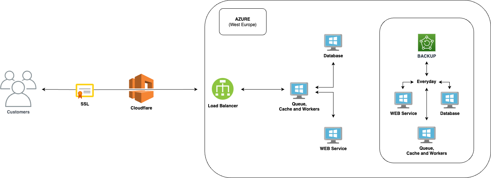

# Platform Security

## Introduction

Keepnet values customers' privacy and takes important steps to protect all customer data. Our main job is to keep any data secure. From this point of view, securing customers' data is one of the crucial jobs our company does. &#x20;

Keeping our systems and customers' data secure is vital to our operations and business. Please also review our [Privacy Policy](https://doc.keepnetlabs.com/legal-hub/for-everyone/website/privacy-policy).

## Information Security Team

Our Information Security team has the industry certifications detailed below.

## Trust & Safety, Transparency, and Abuse Policy

Keepnet is committed to maintaining a **secure, transparent, and responsible** cybersecurity ecosystem while ensuring compliance with industry standards and best practices.

* Customers can run phishing campaigns **only on their own and verified domains**, ensuring ethical and controlled testing.
* All **domains and IP addresses** used in phishing simulations are **dedicated to Keepnet** and managed securely.
* Keepnet enforces **strong security measures** on all IPs and domains, including **TLS encryption, DNSSEC, Bot Protection, WAF, and Firewall protections**, ensuring the integrity and security of our platform.
* All partners are continuously informed about **new phishing domains and IP addresses** to ensure none of our services are affected.
* Keepnet continuously monitors **phishing simulations, phone numbers, and content**, proactively updating security vendors, threat intelligence services, and companies.
* Keepnet also includes **identifiable markers in email headers and landing pages** to inform threat analysis tools that the activity is a **simulated phishing exercise**, promoting transparency and responsible testing.

## Certified and Transparent: Our Compliance Standards

Keepnet maintains rigorous compliance standards to ensure the integrity of its products and internal operating procedures. We are proud to continuously achieve ISO 27001, ISO 27017, ISO 27018, and ISO 42001:2023 certifications. Our adherence to these standards demonstrates our commitment to best practices and transparency.

## Keepnet ISO 27001

ISO 27001 is a global security standard that is recognized internationally for managing security risks to data. Certification to ISO 27001 proves that we are managing the information security in line with the security standards and adopting a process-based approach for establishing, implementing, operating, monitoring, maintaining, and improving  Information Security Management System.&#x20;


Download our ISO 27001 certificate.


## Keepnet ISO 27017

ISO/IEC 27017 is a standard created for cloud service providers and users to secure the cloud-based environment and minimize the potential risk of a security incident. This standard is designed to assist in the recommendation and implementation of controls for cloud-based organizations. This is relevant not only to organizations that store information in the cloud but also to providers which offer cloud-based services to other companies that may have sensitive information.


Download our ISO 27017 certificate.&#x20;


## Keepnet ISO 27018

ISO 27018 is the first international standard developed particularly for data privacy in the cloud. According to the [International Organization for Standardization (ISO)](https://www.iso.org/standard/76559.html), the purpose of this standard is to establish “commonly accepted control objectives, controls, and guidelines for implementing measures to protect Personally Identifiable Information (PII).” ISO 27018 defines best practices for information security management on the cloud. ISO 27018 adds new guidelines, enhancements, and security controls to the ISO/IEC 27001 and ISO/IEC 27002 standards, which help cloud service providers better manage the data security risks unique to PII in cloud computing.


Download our ISO 27018 certificate.&#x20;


## **Keepnet ISO/IEC 42001:2023**

ISO/IEC 42001:2023 establishes a framework for managing artificial intelligence systems responsibly within organizations. This international standard, developed by ISO and IEC, emphasizes ethics, risk management, transparency, and data integrity in AI operations. Keepnet's certification under ISO/IEC 42001:2023 reflects our commitment to maintaining the highest standards of data privacy and system reliability, ensuring that our AI solutions are both trustworthy and compliant with global regulations.



## Accessibility and WCAG 2.1

Keepnet is committed to making our products and training content accessible to all users. We align with **WCAG 2.1** (Web Content Accessibility Guidelines) and strive to meet applicable conformance levels for the platform and for security awareness training delivered through Awareness Educator. Our accessibility efforts cover the learner-facing experience and, where applicable, authoring and administration interfaces. For questions or to request accessibility-related documentation, please contact [Keepnet Support](keepnet-support-help-desk.md).

## Architecture

Keepnet's platform is designed for **high scalability, reliability, and security**, leveraging partnerships with **Cloudflare, Azure, and Amazon**. It operates on a globally distributed infrastructure, ensuring resilience and high availability.

* **Multi-cloud deployment** across AWS, Azure, and Cloudflare.
* **Microservices-based architecture** for efficient scaling.
* **Edge computing** through AWS CloudFront to optimize content delivery.
* **API-first design** enables seamless integrations with third-party tools.

## Data Center Location

### Microsoft Azure Data Center for the USA

Keepnet also hosts one of its other production environments within Microsoft Azure Cloud for the USA. Microsoft Azure Cloud uses the [Shared Responsibility Model](https://learn.microsoft.com/en-us/azure/security/fundamentals/shared-responsibility), and manages the cloud security.

<figure><figcaption>
Microsoft Azure - High-level Design for USA
</figcaption></figure>

Keepnet is responsible for security in the cloud, and you can find more details on the platform security page.

<table><thead><tr><th width="115.33333333333331" align="center">Product</th><th width="153" align="center">Production</th><th align="center">Disaster Recovery</th></tr></thead><tbody><tr><td align="center">Keepnet Products</td><td align="center">Microsoft Azure Data Center in Central US and East US 2</td><td align="center">
<strong>We use Microsoft Azure's Geo-restore</strong>

The geo-restore feature restores the server using geo-redundant backups. The backups are hosted in your server's <a href="https://learn.microsoft.com/en-us/azure/availability-zones/cross-region-replication-azure">paired region</a>. You can restore from these backups to any other region. The geo-restore creates a new server with the data from the backups. Learn more about geo-restore from the <a href="https://learn.microsoft.com/en-us/azure/postgresql/single-server/concepts-backup">backup and restore concepts article</a>.
</td></tr></tbody></table>

Keepnet has an on-premise installation that gives the ability to host the product in your own environment. Moreover, it is possible to host it on Google Cloud, Microsoft Azure, and any other virtualization platform. Please get in touch with us at support@keepnetlabs.com for any questions.

### Microsoft Azure Data Center for the UK and Europe

Keepnet hosts the production environment within Microsoft Azure Cloud in the UK and Europe. Microsoft Azure Cloud uses the [Shared Responsibility Model](https://learn.microsoft.com/en-us/azure/security/fundamentals/shared-responsibility), and manages the cloud security.

<figure><figcaption>
Microsoft Azure - High-level Design for the UK and Europe
</figcaption></figure>

Keepnet is responsible for security in the cloud, and you can find more details on platform security.

<table><thead><tr><th width="119.33333333333331" align="center">Product</th><th width="165" align="center">Production</th><th align="center">Disaster Recovery</th></tr></thead><tbody><tr><td align="center">Keepnet Products</td><td align="center">Microsoft Azure Data Center in the West and South of the UK</td><td align="center">
<strong>We use Microsoft Azure's Geo-restore</strong>

The geo-restore feature restores the server using geo-redundant backups. The backups are hosted in your server's <a href="https://learn.microsoft.com/en-us/azure/availability-zones/cross-region-replication-azure">paired region</a>. You can restore from these backups to any other region. The geo-restore creates a new server with the data from the backups. Learn more about geo-restore from the <a href="https://learn.microsoft.com/en-us/azure/postgresql/single-server/concepts-backup">backup and restore concepts article</a>.
</td></tr></tbody></table>

Keepnet has an on-premise installation that gives the ability to host the product in your own environment. Moreover, it is possible to host it on Google Cloud, Microsoft Azure, and any other virtualization platform. Please get in touch with us at support@keepnetlabs.com for any questions.

## Data in Transit

Keepnet leverages Cloudflare's advanced security services to protect data in transit. This includes full SSL encryption with TLS 1.2 and TLS 1.3, which encrypts all data before it travels across the internet, ensuring that sensitive information remains secure from interception. Additional layers of security are provided by Cloudflare’s suite of features, including:

* **Web Application Firewall (WAF):** This firewall guards against common web exploits and vulnerabilities, ensuring that malicious traffic is blocked before reaching Keepnet's infrastructure.
* **Bot Protection:** This feature distinguishes between legitimate users and malicious bots, blocking harmful traffic while allowing genuine user access.
* **Javascript Challenge:** By issuing challenges that require the execution of Javascript, Keepnet can prevent automated attacks and ensure that only browsers capable of executing Javascript can access the site.
* **Data Loss Prevention (DLP):** This involves monitoring and controlling data transfers to prevent unauthorized data exfiltration.
* **DOS/DDOS Protection:** Cloudflare mitigates denial-of-service attacks, preserving availability and performance even under attack.
* **Captcha Features:** Captchas help distinguish human users from bots, adding an additional layer of security against automated attack tools.
* **DNSSEC Protection:** Keepnet has DNSSEC enabled for all domains, protecting users from DNS spoofing attacks by ensuring that DNS responses are authentic and have not been tampered with.

To further enhance security, Keepnet also implements the following protocols and controls:

* **HTTPS Protocols:** All traffic is served over HTTPS, which uses SSL/TLS encryption to create a secure channel over an insecure network.
* **Network Segmentation and Access Control:** This limits the reach of any potential intruder within the network and ensures that only authorized personnel have access to sensitive data.
* **Regular Security Audits and Compliance Checks:** Keepnet conducts regular audits to ensure that all security measures are effective and compliant with current standards and best practices.
* **Advanced Threat Intelligence:** Keepnet uses threat intelligence feeds to proactively identify and respond to new threats as they emerge, enhancing its adaptive security stance.

By integrating these advanced tools and rigorous policies, Keepnet ensures that all data in transit is well-protected against a wide range of digital threats, maintaining client data’s confidentiality, integrity, and availability.

## **Data at Rest Encryption Flow**&#x20;

We use  persisting encrypting/decrypting data.&#x20;

Data is encrypted/decrypted and persisted as encrypted on the database with Data Encryption Key. Without this key, the data can’t be visible as plain text.&#x20;

The Data Encryption Key is sent to the database by the Application to encrypt/decrypt data.

The encryption method is symmetric encryption with the AES-256 algorithm.&#x20;

The Data Encryption Key is a cryptography random string with a certain length salted with another random cryptographically string.

The data, like credentials, email addresses, and company names, are encrypted.

For more information about  encryption options, please check [this official guide](https://www.postgresql.org/docs/8.1/encryption-options.html).

## Data at Rest Encryption for Files

Keepnet has developed a new feature that automatically encrypts all files sent or uploaded to their platform using AES encryption. This feature provides enhanced security and ensures that all data stored on the platform is protected against unauthorized access, theft, and other security threats. Users do not need to take any additional action to protect their files, as the encryption process is automatic.

AES encryption is a widely used encryption algorithm that is considered to be highly secure and is widely used by governments, financial institutions, and other organizations that need to protect sensitive data. Keepnet's encryption feature uses AES encryption with a randomly generated key to encrypt files, which are stored on its servers. The files can only be accessed by authorized services with the correct decryption key. By using Keepnet's encryption feature, users can rest assured that their files are protected against security threats without needing to worry about any additional steps or features.

For more information, please [contact us](keepnet-support-help-desk.md).

## Policies

Below is a summary of each policy. Full policy text is available to customers upon request.

### Password Policy

We prioritize the security of our users' data. As part of our commitment to maintaining the highest security standards, we have implemented a robust password policy on our platform. This policy is designed to ensure that all user accounts remain secure from unauthorized access.

#### Password Complexity

We require all passwords to meet the following complexity requirements:

* **Length:** Passwords must be at least 8 characters long.
* **Character Types:** Passwords must include at least 1 uppercase letter, 1 lowercase letter, 1 number, and 1 special character (e.g., !, @, #, $, %, ^, &, \*).
* **No Personal Information:** Passwords should not contain any personal information such as your name, username, or date of birth.

#### Password Expiration

We understand that frequent password changes can sometimes lead to less secure behaviors, such as users choosing simpler passwords or reusing old ones. Therefore, we do not enforce a mandatory password expiration period. However, we strongly recommend that you change your password periodically and whenever you suspect that your account may have been compromised.&#x20;

Remember, choosing a unique and complex password and updating it regularly is one of the most effective ways to secure your account.

#### Account Lockout Policy

We prioritize user convenience while maintaining high-security standards. We understand that users may occasionally enter their passwords incorrectly. Therefore, we do not implement an account lockout policy after a certain number of unsuccessful login attempts.

#### Password Storage

We store passwords in a secure manner using modern cryptographic methods. All passwords are hashed and salted, ensuring that even in the unlikely event of a data breach, your password cannot be deciphered.

For more information, please click [here](compliance.md#next-generation-ui-data-encryption-flow).

#### Two-Factor Authentication (2FA)

We take the security of your account very seriously. To provide an additional layer of protection, we have implemented mandatory two-factor authentication (2FA) using Multi-Factor Authentication (MFA) for all accounts.&#x20;

When you log in, you'll be asked to enter a code from your MFA application in addition to your password. This ensures that even if someone else knows your password, they won't be able to access your account without the MFA code.

In the event that you can't access your MFA application, we provide an alternative method of authentication via SMS. You can receive a unique code on your registered mobile number, which you can use to access the platform.

Remember, keeping your MFA application and registered mobile number secure is crucial for the safety of your account.

#### Password Recovery

In case you forget your password, you can reset it using the "Forgot Password" option on the login page. An email will be sent to your registered email address with instructions on how to reset your password.

#### Summary

We encourage all users to follow these guidelines to ensure the security of their accounts. If you have any questions or need further assistance, please contact our support team.

Please note that this is a general password policy and may need to be adjusted based on your specific security requirements and standards.

### Information Security Policy

This top-level policy preserves confidentiality, integrity, and availability; includes cloud services and ISMS scope. Full policy text is available to customers upon request.

### ISMS Scope

For the purpose of operating an effective ISMS, the context of the organization is bifurcated into internal and external related parties. It is important to understand the unique context of an organization before starting the planning and scoping of ISMS to ensure the implemented ISMS gives the best return on investment.

To establish the business context for ISMS, we have identified and documented internal and external contexts that the organization must consider when they manage information security risks.

### **HR Policy**

This policy ensures employees and contractors are qualified and access is removed upon termination. Full policy text is available to customers upon request.

### Code of Conduct and Ethics Policy

Keepnet maintains high standards of integrity and ethical conduct; the policy applies to all employees, officers, directors, and stakeholders. Full policy text is available to customers upon request.

### Human Rights

Keepnet supports human rights and integrates them into business practices; the policy applies to all operations and stakeholders. Full policy text is available to customers upon request.

### Social Responsibility and Sustainable Development Policy

This policy aligns operations with societal and environmental sustainability and applies to all employees and stakeholders. Full policy text is available to customers upon request.

### Anti-Bribery and Anti-Corruption Policy

Keepnet has a zero-tolerance position on bribery and corruption and is committed to conducting business ethically and in compliance with applicable laws (including the UK Bribery Act 2010). The policy applies to all employees, contractors, and associated third parties. Full policy text is available to customers upon request.

### Environmental Policy

Keepnet is dedicated to operating in an environmentally responsible manner, reducing environmental impact and complying with relevant environmental regulations. The policy applies to all operations, including product development, service delivery, office management, and remote work. Full policy text is available to customers upon request.

### Diversity and Equal Opportunity Policy

Keepnet is committed to fostering an inclusive and equitable workplace, ensuring equality and prohibiting discrimination. The policy applies to all employees, contractors, and job applicants. Full policy text is available to customers upon request.

### HSEE

This policy ensures appropriate measures for health, safety, environmental, and energy-related risks and applies to all physical and digital assets and personnel. Full policy text is available to customers upon request.

### Modern Slavery

Keepnet is committed to preventing and eradicating modern slavery and human trafficking within its operations and supply chains. Full policy text is available to customers upon request.

### Acceptable Use Policy&#x20;

We have outlined the acceptable use of information and IT resources for our employees/contractors. All employees/contractors are required to comply with the requirements in this policy. &#x20;

This policy is intended to limit the use of information and IT resources. The objective of this policy is to outline the acceptable use of computer equipment at our company.  These rules are in place to protect the employee/contractor and our company. Inappropriate use exposes the company to risks, including virus attacks, compromise of network systems and services, and legal issues.

Full policy text is available to customers upon request.

### Access Control and Password Policy

The objective of this policy is to establish an access control capability throughout our company and its business units to help the organization implement security best practices with regard to password management, logical security, account management, and remote access.

This policy applies to all our employees/contractors and affiliates.

This policy is applicable to all information technology resources owned or operated by our company.

Full policy text is available to customers upon request.

### Web Application Security Policy

Web application vulnerabilities account for the largest portion of attack vectors outside of malware. It is crucial that any web application is assessed for vulnerabilities and any vulnerabilities by remediated prior to production deployment.

The purpose of this policy is to define web application security assessments within the platform. Web application assessments are performed to identify potential or realized weaknesses as a result of inadvertent misconfiguration, weak authentication, insufficient error handling, sensitive information leakage, etc.  Discovery and subsequent mitigation of these issues will limit the attack surface of our services available.

Full policy text is available to customers upon request.

### System Documentation Policy

This policy defines the level of system documentation required, such as configuration information and services that are running.&#x20;

This policy is designed to provide service stability by ensuring that system documentation is complete and current. This policy complements business continuity management and disaster recovery by ensuring that documentation is available in the event that systems should need to be rebuilt. This policy will help reduce troubleshooting time by ensuring that appropriate personnel is notified when changes are made to any system.

Full policy text is available to customers upon request.

### Supplier Security Policy

This policy specifies controls to reduce the information security risks associated with outsourcing.&#x20;

Supplier security policy applies to our employees and outsourcers, including hardware and software support and maintenance staff, external consultants and contractors, IT or business process outsourcing firms, and temporary staff.

Full policy text is available to customers upon request.

### Remote Working Policy

This policy has been developed to protect sensitive or valuable data and maintain the overall security of our data and equipment whilst employees/contractors are working remotely. In addition, this policy recognizes and defines our duty and care to the remote working employees in regard to their health and safety and fair treatment.&#x20;

Employees/contractors must ensure the security of information and systems accessed through mobile and remote working arrangements are given due consideration. This policy emphasizes the importance of staff understanding our current information security policies and procedures and each individual’s responsibilities in relation to these, which must be adhered to at all times.

### Media Protection Policy

The information resides in many forms and can be stored in different ways. Media controls are protective measures specifically designed to safeguard electronic data and hardcopy information. This policy addresses the protection, marking, sanitization, production input/output, and disposal of media containing sensitive information. &#x20;

This policy applies to all our employees/contractors and affiliates.

Full policy text is available to customers upon request.

### Database Credentials' Security Policy&#x20;

Database authentication credentials are a necessary part of authorizing an application to connect to internal databases. However, incorrect use, storage, and transmission of such credentials could lead to the compromise of very sensitive assets and be a springboard to wider compromise within the organization. &#x20;

This policy states the requirements for securely storing and retrieving database credentials for use by a program that will access a database running on our networks. Software applications running on our networks may require access to one of the many internal database servers. In order to access these databases, a program must authenticate to the database by presenting acceptable credentials. If the credentials are improperly stored, the credentials may be compromised, leading to a compromise of the database.

Full policy text is available to customers upon request.

### Data Protection Policy&#x20;

We are committed to compliance with all relevant EU and Member State laws in respect of personal data and the protection of the “rights and freedoms” of individuals whose information we collect and process in accordance with the General Data Protection Regulation (GDPR). To do this, we comply with the Data Protection Principles which are set out in this policy. &#x20;

The purpose of this policy is to set out our obligations and to demonstrate its commitment to compliance with it. The policy aims to fulfil the data protection requirements for personal data, which we collect and process in accordance with the General Data Protection Regulation (GDPR).

Full policy text is available to customers upon request.

### Cryptography Policy&#x20;

The purpose of this Policy is to protect the confidentiality, integrity and availability of our information by applying appropriate levels of cryptographic controls.&#x20;

**As part of our Cryptography Policy, we keep all data encrypted in our database.**&#x20;

The scope of this policy applies to information system resources, including but not limited to data networks, servers, personal computers, mobile devices located at our, and not our locations, where these resources are under the jurisdiction and/or ownership of ours. Third parties with access to high or critical data owned by us shall also adhere to this policy.

Full policy text is available to customers upon request.

### Configuration Management Policy

Configuration management manages the configuration of all hardware and software elements of information systems and networks and the security implications when changes occur. The initial configuration of the system or network must be documented in detail, and all subsequent changes to any components must be controlled through a complete and robust configuration management process. This policy complements business continuity management and disaster recovery by ensuring that documentation is available in the event that systems should need to be rebuilt. This policy will help reduce troubleshooting time by ensuring that appropriate personnel are notified when changes are made to any system.

Full policy text is available to customers upon request.

### Clean Desk Policy

A clean desk policy can be an important tool to ensure that all confidential/restricted materials are removed from an end-user workspace and locked away when the items are not in use or an employee/contractor leaves his/her workstation. It is one of the top strategies to utilize when trying to reduce the risk of security breaches in the workplace. Such a policy can also increase employee’s/contractor's awareness about protecting sensitive information. &#x20;

The purpose of this policy is to establish the minimum requirements for maintaining a clean desk – where sensitive/critical information about our employees/contractors, our intellectual property, our customers and our vendors is secure in locked areas and out of site. A Clean Desk policy is not only ISO 27001 compliant, but it is also part of standard basic privacy controls.

Full policy text is available to customers upon request.

### Change Management Policy&#x20;

We recognise that changes (the addition, modification, or removal of anything) to the organisation, business processes, information processing facilities, and systems that affect information security needs to be effectively managed and is extremely important in ensuring the quality delivery of our services.  We are aware that ineffective and uncontrolled change management could potentially result in significant system disruption, data corruption or loss. We have, therefore, formulated this Change Management Policy / Process in order to address the opportunities and associated risks. We will continue to formally manage changes to its Information Technology (“IT”) / business resources to prevent disruptions to the stability, confidentiality, integrity and availability of our IT systems, business processes and data.

### Cloud Asset Management Policy

We have developed this policy to provide guidance on the use of cloud technology.&#x20;

The objectives of our cloud asset management program include:&#x20;

* Ensuring that cloud-based assets are included in the IT asset management program.
* Optimizing the cost of and value received from cloud services.
* Mitigating security and compliance risks posed by cloud services.

## Procedures

Please find below high-level policies and procedures. Details of policies and procedures are shared with customer upon their request.

Below is a high-level description of each procedure. Detailed procedures are shared with customers upon request.

### Document Management Procedure

The purpose of this Procedure is to create a method to provide the necessary control for the preparation, approval, release, revision, and distribution of the documentation used for management systems and business processes.

This procedure covers Management Systems and Business Processes documentation.

Detailed procedure is available upon request.

### The Data Restoration Procedure

This outlines the protocol for restoring personally identifiable information (PII) that becomes inaccessible, unless it has been contractually destroyed or erased. The Information Security Manager oversees the restoration process while the IT Department manages the recovery of digital PII data, and the Facilities Manager handles hard-copy PII data. All restoration efforts must be documented in the PII Data Restoration Record. The document's maintenance, accessibility, and approval are under the jurisdiction of the Information Security Manager. Specific systems, measures, document recipients, and storage locations are yet to be defined.

Detailed procedure is available upon request.

### Information Security Roles & Responsibilities

The purpose of this document is to clearly define the roles and responsibilities that are essential to the implementation and continuation of the information security system in our platform.&#x20;

Detailed procedure is available upon request.

### Risk Management Procedure

The purpose of this document is to define the risk management methodology followed in our platform.

Risk is the function of a source of threat, the possibility of using an existing weakness, and the negative impact of this situation. We conduct risk management activities in order to control the negative effects of the risks associated with the information assets. On the other hand, these activities also have the potential to create opportunities for our platform in different areas.

Detailed procedure is available upon request.

### Internal Audit Procedure

The purpose of this procedure is to explain the responsibilities and methods for the planning and implementation of internal audits in order to review, evaluate and assess the information security management system within our organisation.

Detailed procedure is available upon request.

### Management Review Procedure

This procedure sets out the arrangements for conducting periodic formal management reviews of our information security management system.

Detailed procedure is available upon request.

### Continual  Improvement Procedure

To describe the process by which our Management System considers every problem, such as systematic problems or opportunities for improvement, audit findings, etc., to ensure that the problem is identified, investigated and prevented from reoccurring.

Detailed procedure is available upon request.

### Secure System Engineering Principles

This document compiles a set of engineering principles to aid in designing a secure information system. These principles provide a foundation upon which a more consistent and structured approach to the design, development and implementation of IT security capabilities can be constructed.

While the primary focus of these principles is the implementation of technical controls, these principles highlight the fact that to be effective, a system security design should also consider non-technical issues, such as policy, operational procedures, and user education and training.

Detailed procedure is available upon request.

### Security Event Monitoring Procedure

This document explains the procedure to be followed by information system owners or any other relevant users of the organization to implement the requirement specified in the information security policy regarding monitoring system access and use.

This procedure applies to all users of Keepnet Labs’ information systems and information assets regardless of location, third parties in respect of the service that they provide and asset owners with respect to the assets that they own.
Detailed procedure is available upon request.

### Internal Audit Procedure

The purpose of this procedure is to explain the responsibilities and methods for the planning and implementation of internal audits in order to review, evaluate and assess the information security management system within the organization.

This procedure applies to all departments and business units within the scope of the Keepnet Labs' ISMS.

Detailed procedure is available upon request.

### Data Retention and Disposal Procedure

The purpose of this procedure is to detail the activities for the retention and disposal of information to ensure that Keepnet Labs LTD carries this out consistently and documents relevant actions taken. Unless otherwise specified, the retention and disposal policy refers to both hard and soft copy documents.&#x20;

Keepnet Labs LTD will ensure that information is not kept for longer than is necessary and will retain the minimum amount of information that it requires to carry out its business functions.&#x20;

Detailed procedure is available upon request.

### Business Continuity Planning

Business Continuity Management is in place to counteract interruptions to business activities and to protect critical business processes from the effects of major failures or disasters.

This business continuity strategy provides a framework that is consistent with corporate governance best practice.  It is closely linked to risk management and information security (the company is aligned to ISO27001), the disciplines complementing each other.  Business continuity plans provide structured guidance and procedures to help the company protect the welfare and deliver a minimum level of service in its critical functions following a disruptive incident.  They also help the company to recover in an organised manner.  An effective response will rely on a coordinated approach across different parts of the company, therefore provides a focal point for the validation and review of the Company’s business continuity activities.

It is the policy of the company to take all reasonable steps to ensure that in the event of a service interruption, the organisation will be able to maintain essential services and restore normal services as soon as possible in the circumstances prevailing at the time. The Business Continuity Management (BCM) Policy aims to introduce the concept of BCM to the company.&#x20;

Detailed procedure is available upon request.

### Access Management Procedure

The purpose of this process is to:&#x20;

* Clearly outline the steps that Keepnet will take to manage user access to Keepnet’s systems and data;&#x20;
* Provide details of approval mechanisms, the process by which access is granted, modified and deleted and key roles and responsibilities;&#x20;
* Apply the principle of least privilege to limit the access or functionality that different users have;&#x20;
* Protect confidentiality, integrity and availability by managing access rights;&#x20;
* Review access permissions to ensure they are correct.

Detailed procedure is available upon request.

### Incident Management Procedure

The purpose of this procedure is to record and be informed of company information security and personal data breach incidents and perceived weaknesses, to respond to security breaches, to create an action plan against violations and weaknesses, and to take measures against threats with the information obtained.

Detailed procedure is available upon request.
